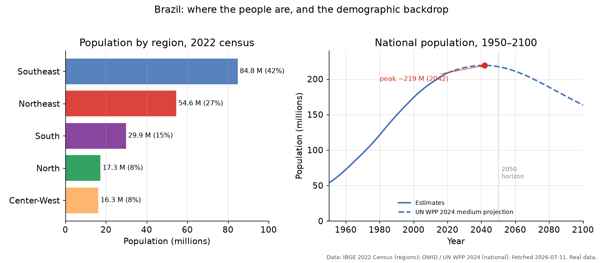
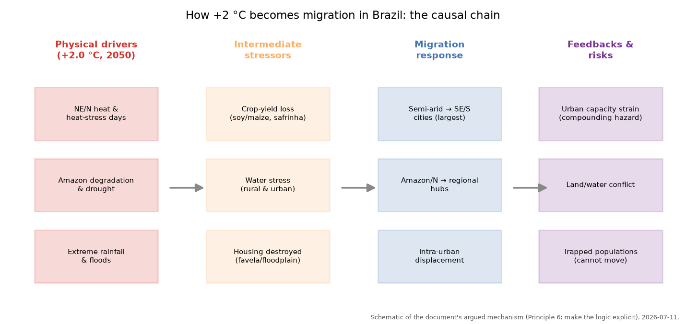
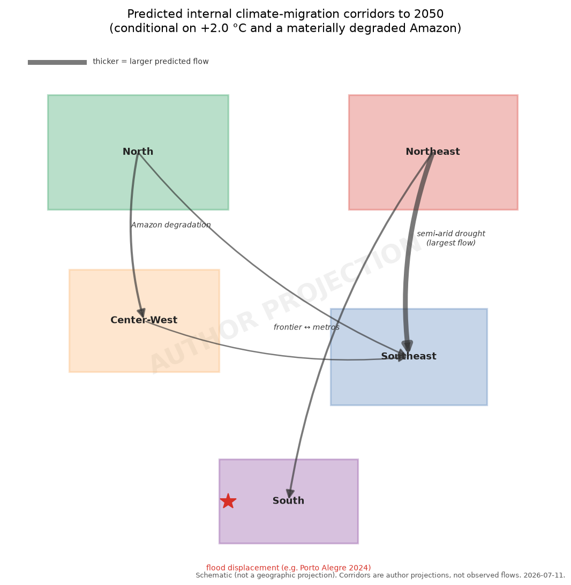
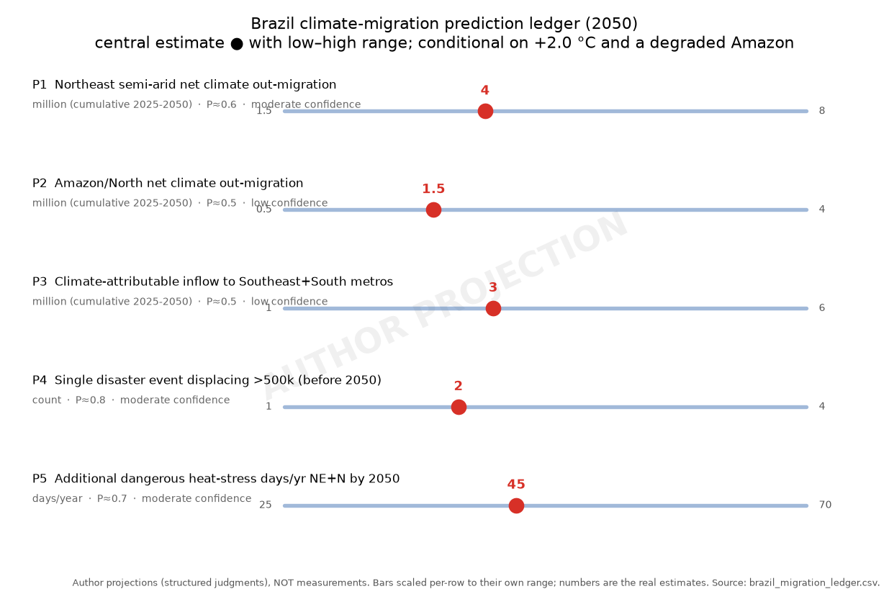

# Climate Migration — Prediction 1: Brazil to 2050

*Climate Intelligence — predictions series*
*Prepared by Claude with J. X. Prochaska · 2026-07-11*
*Scenario-conditional. This is a forecast, not an assessment — read §1 and §2 first.*

---

## 1. Purpose and how to read this

This is the first entry in the Climate Intelligence *predictions* series. It
forecasts how climate change, interacting with Brazil's demography and economy,
will reshape **where Brazilians live by 2050**. Prediction is a difficult and
often embarrassing business — the field's history (§3) is littered with numbers
that never came true — so this document is built to be **falsifiable and
honest about uncertainty**, following the blog's principles: *fact carries its
uncertainty and bias* (P1), *viewpoints are weighed, not counted* (P2),
*statistics are respected* (P5), and *the causal logic is made explicit* (P6).

Two things travel together here: a **prose essay** (§§3–8) that argues a
mechanism and a direction, and a **falsifiable prediction ledger** (§9) that
commits to dated, numbered, quantified statements with probabilities and
verification criteria, so a future reader can score us. Where a figure shows
our own projections rather than measured data, it is watermarked **"author
projection"** — do not mistake the two.

## 2. Key assumptions (the forecast is conditional on all of these)

This forecast is **not** an unconditional best guess. It holds only under the
scenario the authors fixed in scoping. State them with the number every time it
is quoted:

1. **Warming: +2.0 °C global mean (vs pre-industrial) by 2050.** This is a
   deliberately *fast* warming assumption — mainstream central estimates cross
   ~1.5 °C in the early 2030s and reach 2 °C nearer 2050–2060, so treat +2.0 °C
   *at* 2050 as a stress-test upper-middle path, not the median. The
   architecture is built to be re-run at +1.5 °C and +2.5–3 °C.
2. **The Amazon tipping point is assumed triggered and the biome materially
   degraded by 2050.** Large tracts of southern/eastern Amazon have transitioned
   toward degraded/savanna states; "flying-river" moisture recycling is
   measurably weakened. (In the literature this is *plausible but not certain*
   by 2050 — most estimates place the transition in the 2040s–2070s and make it
   as much a deforestation story as a temperature one. We adopt it by
   instruction, and flag it as the single largest swing factor.)
3. **Internal migration dominates; international is secondary** (evidence in §5).
4. **Demographic backdrop (independent of climate):** Brazil's national
   population peaks ~2040 near 219 million and is already *declining* by 2050
   (~217 M), with fertility ~1.5 — below replacement. Climate migration
   therefore redistributes a *stagnant-to-shrinking*, rapidly urbanizing, aging
   population, not a growing one.
5. **World demand for Brazilian soy/beef/biofuel** is taken as a best-guess
   extrapolation of current trajectories (§4e) and flagged as a major swing
   factor, not modeled endogenously.
6. **No major discontinuities** assumed in Brazil's political stability, border
   regime, or global order (each flagged as a tail risk in §6).

## 3. The Brazilian baseline

**Where people are.** Brazil's 203 million (2022 census) are unevenly spread
(Figure 1, left): the **Southeast** holds ~85 M (42%; São Paulo, Rio, Minas),
the **Northeast** ~55 M (27%), the **South** ~30 M, and the **North** (Amazon)
and **Center-West** ~17 and ~16 M. The country is already **87% urban** — the
rural-to-urban transition is largely *complete*, which matters: the classic
climate-migration story (farmers pushed to cities) has less runway left than in,
say, sub-Saharan Africa.

**The demographic clock (Figure 1, right).** Unlike the push-side demographies
elsewhere in the migration literature, Brazil is not a Malthusian case. The UN
WPP 2024 medium projection peaks the national population ~2040 at ~219 M, then
declines; total fertility is ~1.5 and falling. So the 2050 question is *where a
shrinking, aging population concentrates* — climate acts on the **distribution**,
not the size.

**The historical template.** Brazil's defining 20th-century internal migration
was **climate-adjacent and internal**: waves of *nordestinos* leaving the
drought-prone semi-arid *sertão* for São Paulo and the industrial Southeast,
drought acting *through* rural poverty. Any 2050 forecast should expect
variations on that corridor, not a novel pattern.

**Figure 1.** *Real data.* Brazil's population by region (2022 census, left) and
the national trajectory with the UN WPP 2024 medium projection (right); the
national peak arrives ~2040. Sources: IBGE; OWID/UN.

## 4. Drivers under the scenario

Figure 4 lays out the causal chain this section argues: physical drivers →
intermediate stressors → migration response → feedbacks. The logic, not any
single number, is the point (P6).

**Figure 4.** *Schematic.* How +2 °C becomes migration in Brazil — the argued
mechanism, left to right.

**(a) Heat and wet-bulb stress (Northeast and North).** At +2.0 °C, Brazil does
**not** reach the lethal 35 °C wet-bulb threshold at 2050 in any sustained way —
that is an end-century, high-emissions tail risk we explicitly *do not* score
here. The real 2050 story is **dangerous heat-stress days**: a large rise in
days exceeding "extreme caution" wet-bulb-globe-temperature thresholds across
the semi-arid Northeast and the degrading North, cutting safe outdoor-labor
hours in agriculture and construction. This is a *liveability and livelihood*
stressor — it erodes rural incomes and urban outdoor work, feeding the
income-mediated migration channel (§5) rather than forcing instant flight
(ledger P5).

**(b) Amazon degradation and the flying rivers.** Under the assumed tipping
(Assumption 2), weakened moisture recycling means **less rain reaching the
agricultural heartland** — the "flying rivers" that carry Atlantic moisture
across the basin to the Center-West and South are already diminished by ~1
million km² of prior deforestation, and pasture/soy recycle a fraction of what
forest does. The 2023–24 record drought (which hit ~27% of the forest at
three-decade lows) is a preview. Degradation drives out-migration *from* the
North and, critically, undercuts rainfall *far downwind*.

**(c) Agriculture — victim and engine at once.** This is the pivot, and it cuts
both ways (the author asked us not to pre-judge which dominates):
- *Victim:* deforestation-driven rainfall loss already shaves soybean and maize
  yields (documented ~6–10%/yr drag, worse in the *safrinha* second maize crop
  that depends on late-season rain). Under the scenario this worsens, squeezing
  farm incomes in the South, Southeast, and Center-West.
- *Engine:* the agricultural **frontier** (Cerrado, the MATOPIBA belt) keeps
  *pulling* population and capital inland — but mechanized agribusiness creates
  few jobs per hectare, so frontier towns grow modestly while the farm workforce
  does not. Net: agriculture is a **weakening attractor**, not a job engine, and
  in the hardest-hit rainfed zones it flips to a **source** of out-migration.
- *Food self-sufficiency:* Brazil remains, at 2050, broadly **self-sufficient in
  food and a major net exporter** even with yield drag — domestic hunger is a
  distribution/poverty problem, not an aggregate-supply one. So the migration
  driver is *rural income collapse in specific regions*, not national food
  scarcity.

**(d) Floods and extreme rainfall.** The counterpoint to drought: intensifying
extreme rainfall drives **sudden, large, often intra-urban displacement**. The
May 2024 Rio Grande do Sul / Porto Alegre floods displaced ~580,000 people — the
template for ledger P4. These events destroy low-cost and informal housing
(*favela* and floodplain), coupling directly to the blog's homelessness work
(report §7): disasters delete exactly the cheap housing stock that receiving
cities need.

**(e) Biofuel and livestock demand (swing factor, not modeled).** Best-guess
from current trajectories: global decarbonization sustains or grows demand for
Brazilian ethanol and, increasingly, biodiesel/sustainable aviation fuel
feedstock (RenovaBio), while global beef demand plateaus as richer-country diets
shift. High biofuel demand would *intensify* frontier land pressure (more
Cerrado conversion, more inland pull, more deforestation feeding back into
driver b); weak demand would relax it. Because this is set *outside* Brazil, we
treat it as an explicit **swing factor** that could move the internal-migration
totals by a large fraction in either direction.

## 5. The prediction: internal redistribution, not exodus

**Why internal dominates (the evidence the scoping asked for).** Three robust
regularities in the migration literature point the same way:
1. *Migration is mixed-motive and income-mediated.* Climate acts as a "threat
   multiplier" through crops, income, and disaster, rarely as a clean single
   cause. The best-identified econometrics (Cattaneo & Peri 2016) find an
   **inverted-U**: in the poorest agrarian economies warming *traps* people
   (it destroys the resources needed to move), while in middle-income economies
   it raises **rural-to-urban internal** movement. Brazil sits at the
   upper-middle-income, highly urban end — squarely in the internal-movement arm.
2. *Crossing borders costs far more than moving within one* — money, networks,
   legal access. Global disaster displacement (a record 45.8 M new cases in
   2024) is overwhelmingly **internal and often temporary**; the World Bank's
   *Groundswell* projections (up to 216 M by 2050) are **internal by
   construction**.
3. *Brazil's own history and present* confirm it: the *nordestino* corridors are
   the template, and Brazil is today a **net receiver** (>800,000 refugees and
   asylum-seekers at end-2024 — Venezuelans, Haitians, Cubans, Angolans — under
   a liberal 2017 Migration Law and *Operação Acolhida*), not a net sender.

**The corridors (Figure 2).** We predict a **continuation and intensification of
historical internal patterns**, not a new geography:
- **Northeast semi-arid → Southeast and South metros** — the largest flow, the
  *nordestino* corridor under a hotter, drier, more heat-stressed sertão
  (ledger P1).
- **Amazon/North → regional hubs and the Center-West/Southeast** — driven by
  biome degradation, drought, and frontier dynamics (ledger P2).
- **Intra-urban and short-range displacement** from floods (Porto Alegre-type
  events), often *temporary* but sometimes permanent when housing is destroyed
  (ledger P4).

**Figure 2.** *Author projection (schematic, not geographic).* Predicted internal
climate-migration corridors to 2050; arrow width encodes relative predicted flow.

**Destinations are themselves exposed — the compounding trap.** This is the part
that ties to the homelessness work (report §7) and that the scoping flagged as
central: the receiving cities are **not safe harbors**. São Paulo suffered a
near-catastrophic **water crisis in 2014–15**; coastal metros (Santos, Recife,
Rio) face sea-level rise and storm surge; and the *favelas* and floodplains that
absorb low-income migrants are the most flood- and landslide-exposed land in the
country. So migration frequently moves people **from one hazard into another**,
while straining housing, water, and services in the destination. The prediction
is therefore not "people reach safety" but "people relocate into denser, often
differently-hazardous precarity" — with informal-settlement growth and
climate-exposed housing as the visible signature.

**International movement (secondary, both directions).** Brazilian emigration
(to the US, Portugal) is real but economy- and inequality-driven, **not yet
climate-driven**, and we do not expect climate to make it dominant by 2050. More
likely, Brazil **remains a regional receiver**, absorbing climate-and-conflict
displaced people from Andean and Amazonian neighbors (Venezuela, Bolivia, Peru)
and Haiti. Net international climate-attributable flow stays **an order of
magnitude below internal flow**.

**Conflict (scored where credible).** We score two channels at 2050 and flag a
third:
- *Localized resource/frontier conflict* (land, water, deforestation-frontier
  violence against Indigenous and traditional communities): **already real and
  rising** — moderate-to-high probability of measurable increase.
- *Urban political/social strain* from large migrant inflows into
  service-stretched metros: **moderate** probability of episodic strain, low
  probability of systemic breakdown (Brazil has absorbed such flows before).
- *Interstate conflict* (Amazon as an international-security flashpoint;
  trans-boundary water; the Venezuela border): **low probability, explicitly
  flagged**, not scored.

## 6. Uncertainties and what would move the forecast

Ranked by how much they swing the 2050 outcome:
1. **Whether the Amazon actually tips by 2050** (Assumption 2). We adopted it;
   if it does *not*, the North/Center-West drivers weaken materially and P2/P3
   fall.
2. **Adaptation in place** — irrigation, drought-resistant cultivars, urban
   flood defenses, social protection (Brazil's *Bolsa Família* and semi-arid
   cistern programs already blunt drought-migration). Effective adaptation is
   the biggest *downward* lever on all migration numbers.
3. **Global demand for Brazilian ag/biofuel** (§4e) — a large, exogenous swing.
4. **Definition/attribution** — "climate migration" is not cleanly separable
   from economic migration; our numbers are *climate-attributable increments*
   over a baseline, and the attribution itself carries wide error.
5. **Warming path** — at +1.5 °C the drivers are milder; at +2.5–3 °C the
   heat-stress and Amazon terms escalate and lethal wet-bulb re-enters as a
   post-2050 threat.
6. **Political discontinuities** — a shift away from Brazil's liberal migration
   regime, or major instability, would reshape both internal reception and
   international flows.

## 7. Bottom line

Under +2.0 °C and a degraded Amazon, we predict Brazil's climate-migration
future is **mostly internal, mostly a hotter-drier replay of the historical
Northeast→Southeast corridor plus new Amazon/North outflows, punctuated by large
flood-driven displacement events** — redistributing a stagnant, aging, highly
urban population into cities that are themselves increasingly climate-exposed.
It is a story of **compounding precarity and adaptation pressure**, not of
millions fleeing abroad. The single biggest way we could be wrong is the Amazon
assumption; the biggest way the *numbers* could be wrong is effective adaptation
in place.

## 8. Relationship to the rest of Climate Intelligence

This prediction leans on the physical-climate report (heat, sea level, extremes:
report §§3–5), the population section (Brazil's peak-and-decline demography:
context §12), and the homelessness work (destination housing precarity and
disaster-driven housing loss: report §7). It is deliberately the **first, single
-country** entry; the global and other-region migration pictures (Sahel, South
Asia, Central America, small islands, US internal) are staged for later.

---

## 9. Prediction ledger (falsifiable)

All entries are **conditional on the §2 assumptions** (chiefly +2.0 °C by 2050
and a materially degraded Amazon) and are **structured author judgments, not
measurements**. "Climate-attributable" means the *increment over* a
no-additional-climate-change baseline. Probabilities are the authors'; horizon
is 2050 unless stated. Figure 3 plots P1–P5.

**Figure 3.** *Author projection.* The quantified ledger entries — central
estimate with low–high range, per-row scaled (units differ). Generated from
`data/brazil_migration_ledger.csv`, so table and figure cannot drift apart.

| # | Prediction (by 2050, conditional) | Central | Range | P | Confidence | Verification criterion |
|---|---|---|---|---|---|---|
| **P1** | Net **climate-attributable** out-migration from the Northeast **semi-arid** (Semiárido, base ~28 M) | **4 M** | 1.5–8 M | 0.6 | moderate | IBGE inter-regional migration + attribution studies show cumulative 2025–2050 net semi-arid outflow attributable to climate ≥ central |
| **P2** | Net climate-attributable out-migration from the **Amazon/North** | **1.5 M** | 0.5–4 M | 0.5 | low | Same method, North region |
| **P3** | Climate-attributable **inflow to Southeast + South metros** | **3 M** | 1–6 M | 0.5 | low | Metro population studies attribute ≥ central to climate migration |
| **P4** | Number of **single disaster events displacing >500,000** people (Porto-Alegre-scale) | **2** | 1–4 | 0.8 | moderate | IDMC/Civil Defense record ≥1 such event; central = 2 over 2025–2050 |
| **P5** | Additional **dangerous heat-stress days/yr** (WBGT above extreme-caution) in NE+N vs 2000s baseline | **+45** | +25 to +70 | 0.7 | moderate | Reanalysis/station WBGT shows regional mean increase ≥ central |
| **P6** | **Lethal 35 °C wet-bulb** becomes a sustained annual occurrence somewhere in Brazil by 2050 | — | — | **<0.1** | (flagged) | Any station-verified sustained Tw≥35 °C event; we predict this does **not** happen by 2050 |
| **P7** | Brazil **remains a net immigration receiver** (climate-driven emigration stays <10% of internal climate flows) | — | — | 0.75 | moderate | UNHCR/OBMigra stocks: net migration positive; emigration attribution small |
| **P8** | Measurable **rise in localized land/water/frontier conflict** incidents | — | — | 0.7 | moderate | Violence-monitoring datasets (e.g. CPT, ACLED) show upward trend in resource/frontier conflict |
| **P9** | **Interstate** conflict over Amazon/trans-boundary water involving Brazil | — | — | **<0.1** | (flagged) | Any militarized interstate dispute; predicted **not** to occur |
| **P10** | Brazil stays **net food self-sufficient and a major agri-exporter** despite regional yield drag | — | — | 0.8 | moderate | FAO/CONAB: net agricultural exporter, no structural import dependence for staples |

*Scoring note for future-us:* P1–P3 are the genuinely uncertain quantitative
core (wide ranges, modest confidence — they depend on adaptation and on the
Amazon assumption). P4, P5, P7, P10 are higher-confidence directional calls.
P6 and P9 are deliberate **negative** predictions at this horizon. Re-run the
whole ledger if the warming or Amazon assumptions change.

---

## 10. References

*Physical climate & Amazon:*

1. IPCC, 2021/2022. AR6 WGI & WGII (heat, extremes, regional projections; WGII
   Cross-Chapter Box on migration). See CI report §§3–5.
2. Nobre, C. et al. — Amazon tipping point / "flying rivers" moisture-recycling
   work; Science Panel for the Amazon (2021, 2025 reports). Summarized via MAAP
   and Amazon Conservation Association (2025–26).
3. Lovejoy, T. & Nobre, C., 2018. "Amazon tipping point." *Science Advances*
   4(2):eaat2340.
4. PNAS, 2023–2025: "Amazon deforestation reduces precipitation and soybean
   yields across Southern Brazil"; and the 2023–24 Amazon drought analyses
   (Nature *Scientific Reports* 2024; PNAS 2025 on forest damage).
5. Rio Grande do Sul / Porto Alegre floods, May 2024: AGU *Geophysical Research
   Letters* (2024GL112442); PAHO/WHO situation reports (~580,000 displaced).

*Migration theory, data, and forecasts:*

6. World Bank, 2021. *Groundswell Part 2: Acting on Internal Climate Migration*
   (up to 216 M internal climate migrants by 2050). worldbank.org.
7. IDMC, 2025. *Global Report on Internal Displacement (GRID 2025)* — 83.4 M
   internally displaced end-2024; 45.8 M new disaster displacements in 2024.
8. IOM, *World Migration Report* (2024) — international migrant stock ~281 M
   (~3.6%).
9. Cattaneo, C. & Peri, G., 2016. "The migration response to increasing
   temperatures." *Journal of Development Economics* 122:127–146 (the
   inverted-U).
10. Xu, C. et al., 2020. "Future of the human climate niche." *PNAS*
    117(21):11350–11355 — and its own caveat that it is not a migration
    prediction.
11. Boas, I. et al., 2019. "Climate migration myths." *Nature Climate Change*
    9:901–903 (against deterministic mass-migration narratives).
12. UNEP/Myers legacy: the retracted "50 million environmental refugees by 2010"
    forecast — cited as the field's cautionary failure.

*Brazil demography, migration, agriculture, policy:*

13. IBGE, 2022 Census — population by region; 2022 Census urban share (87%);
    inter-regional migration ("19.2 million live outside birthplace").
14. IBGE population projections (national peak ~2041 at ~220 M) and UN WPP 2024
    (Brazil among countries peaking 2025–2054). Data cached in
    `CI_Predictions/data/owid_brazil_population.csv`.
15. UNHCR & OBMigra, 2024–2025: Brazil hosts >800,000 refugees/asylum-seekers;
    Venezuelan/Haitian flows; 2017 Migration Law; *Operação Acolhida*.
16. Wet-bulb/heat-stress projections for Brazil: Brazilian Academy of Sciences
    (AABC) WBGT semi-arid study; global heat-stress exposure projections
    (Rogers et al. / related, ~2020); NASA "too hot to handle" heat-limit work.
17. RenovaBio and Brazilian biofuel/agri-export outlook; CONAB/FAO for
    self-sufficiency framing (best-guess trajectory, §4e — flagged swing factor).
18. Conflict/land-violence monitoring: Comissão Pastoral da Terra (CPT) annual
    *Conflitos no Campo*; ACLED for frontier/resource violence trends.

*Figures.* Figures 1–4 are original, generated reproducibly by
`CI_Predictions/py/make_brazil_migration_figures.py` from data in
`CI_Predictions/data/`. Figure 1 uses real IBGE/UN data; Figures 2–3 visualize
this document's own projections (watermarked "author projection"); Figure 4 is a
mechanism schematic.

---

*Prepared under the Climate Intelligence guiding principles. This is a
scenario-conditional forecast for internal discussion, not a published post, and
not advice. Every quantitative claim is a structured judgment carrying wide
uncertainty; the ledger (§9) exists so these claims can be scored — and
corrected — as the future arrives.*
