# The State of Earth's Climate: An Initial Report

*Climate Intelligence — internal briefing for the blog's writers*
*Prepared by Claude with J. X. Prochaska · 2026-07-09*

---

## 1. Purpose and method

This report is a grounding document for the writers of *Climate Intelligence*.
It summarizes what is known about the physical state of Earth's climate, how well
it is known, and where honest disagreement remains. It is deliberately
quantitative: where a number appears, its **uncertainty** and, where relevant, its
**bias** (a systematic, directional error, as distinct from random scatter) appear
with it.

It follows the blog's guiding principles. In particular: *fact trumps opinion, but
every human measurement carries uncertainty and bias* (Principle 1); *all
viewpoints are welcome but not accepted equally* (Principle 2); *statistics are
respected — a low-probability event is genuinely unlikely* (Principle 5); and
*mathematics trumps all* (Principle 6). Where a scientific question is genuinely
open, this report says so; where a contrarian claim has been tested and found
wanting, it says that too. That is not imbalance — it is Principle 2 applied.

**Sources.** The backbone is the IPCC Sixth Assessment Report (AR6: WGI 2021,
WGII/WGIII 2022, Synthesis 2023) and three Special Reports (SR1.5, SROCC, SRCCL),
supplemented by primary data archives (NOAA, NASA, CSIRO, the Global Carbon
Project) and by the 2025 U.S. Department of Energy "Climate Working Group" report
and its 85-author expert rebuttal, which together bracket the live debate. Full
citations are in §10; data portals are catalogued in `context/references.md`.

**On uncertainty.** Following IPCC calibrated language, *likely* denotes ≥66%
probability and *very likely* ≥90%; quantitative ranges are 5–95% ("very likely")
unless noted. Ranges here are not decoration — a projection without a range is not
a scientific statement.

---

## 2. Historical context

**Deep time.** CO₂ and temperature have varied enormously across geological time;
atmospheric CO₂ was many times higher hundreds of millions of years ago. Contrarian
writers correctly note this (the DOE report emphasizes it). The relevant point for
today is not the *absolute* level but the *rate*: the current rise of ~2–3 ppm per
year is roughly a hundred times faster than the fastest natural changes in the
ice-core record, and ecosystems and coastlines respond to rates, not just levels.

**The instrumental inflection.** Pre-industrial CO₂ was ≈ 280 ppm (stable for
millennia). The Industrial Revolution began a rise that is now unmistakable:
CO₂ passed 430 ppm at the 2025 Mauna Loa peak — higher than at any time in at least
2 million years, on paleo-proxy evidence.

**What the ice cores show.** Antarctic ice cores (EPICA Dome C) give a continuous
CO₂ and temperature record back ~800,000 years. Across eight glacial cycles CO₂
oscillated between ≈180 ppm (glacial) and ≈280 ppm (interglacial) — and *never*
exceeded ~300 ppm. The fastest natural CO₂ rises in that record ran ~10–20 ppm per
*thousand* years; the modern rise is ~2–3 ppm per *year*, roughly two orders of
magnitude faster. That rate comparison, not any single absolute value, is the
scientifically load-bearing point, and it is why appeals to a warm, high-CO₂
Mesozoic are a category error: nothing with a modern coastline or a modern harvest
calendar evolved under a change this fast.

**The arc of the science.** The greenhouse effect is not new physics. Fourier
(1820s) recognized the atmosphere retains heat; Tyndall (1859) measured the
infrared absorption of CO₂ and water vapour in the laboratory; Arrhenius (1896)
first estimated the warming from doubling CO₂ and got an answer — a few degrees —
close to today's. Keeling began the continuous Mauna Loa CO₂ record in 1958
(Figure 1). The 1979 U.S. National Academy "Charney Report" assessed the
equilibrium warming from doubled CO₂ at **1.5–4.5 °C** — a range essentially
unchanged for four decades, a fact that cuts both ways: it reflects deep, genuine
difficulty in pinning down feedbacks, and it shows the central estimate has been
robust to 45 years of scrutiny.

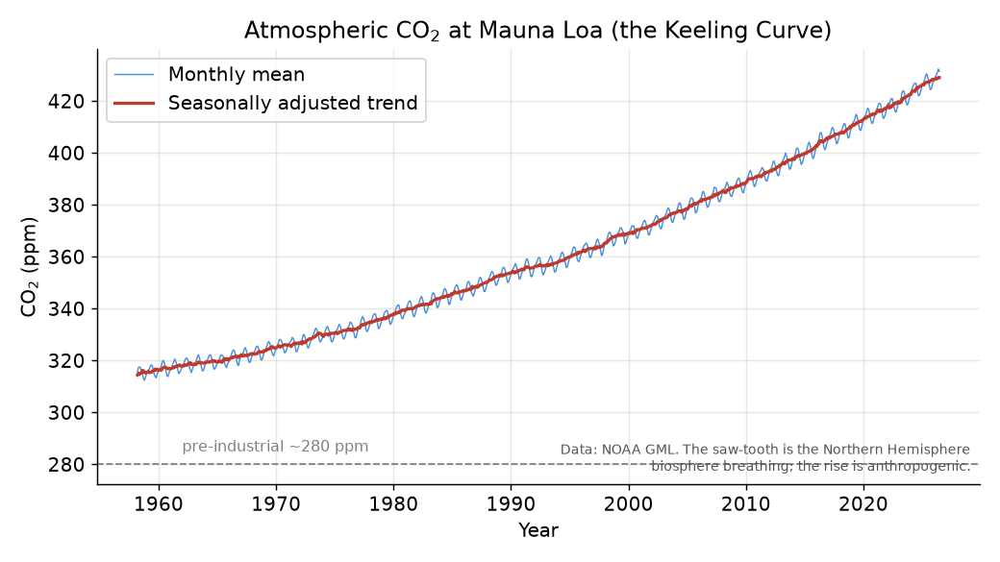

**Figure 1.** The Keeling Curve: monthly atmospheric CO₂ at Mauna Loa (NOAA GML).
The annual saw-tooth is the Northern Hemisphere biosphere inhaling each spring and
exhaling each autumn; the relentless underlying rise is anthropogenic. The
seasonally adjusted trend (red) removes the biological breathing to expose the
secular increase.

---

## 3. The current state of the Earth

Every subsection below pairs the central estimate with its uncertainty and its
known biases. A recurring theme: the indicators differ enormously in how cleanly
they can be measured, and honest reporting means saying which numbers are sharp and
which are fuzzy.

### 3.1 Temperature

Global mean surface temperature in 2011–2020 was **1.09 °C [0.95–1.20]** above the
1850–1900 baseline (AR6 WGI). Land warmed faster (≈1.6 °C) than ocean (≈0.9 °C), a
robust and physically expected land–sea contrast.

*Uncertainty and bias.* Four independent groups — NASA GISTEMP, NOAA, the UK's
HadCRUT5, and Berkeley Earth — plus reanalyses (ERA5) compute the global anomaly.
They **agree to within ~0.05 °C** on recent decadal trends, which is itself strong
evidence: the warming is not an artifact of one team's choices. The known biases
are real and corrected-for, not ignored: changing instruments (buckets → engine
intakes → buoys for sea-surface temperature), station moves, time-of-observation
changes, and — the contrarians' favourite — **urban heat islands (UHI)**. The DOE
report argues residual UHI inflates land trends. The mainstream position, supported
by studies comparing rural-only stations, is that UHI is corrected to within
≈10% of the land trend and cannot explain ocean warming (71% of the surface) or the
warming seen in reanalyses and satellites. This is a legitimate area to *quantify*,
not a reason to doubt the trend's sign or rough magnitude.

Figure 2 shows the GISTEMP record. Note the baseline: GISTEMP uses 1951–1980, so
its recent ~+1.0 °C anomalies become ~+1.3 °C against a pre-industrial baseline.
**Baseline choice is a common source of confusion and occasional rhetorical
mischief — always state it.**

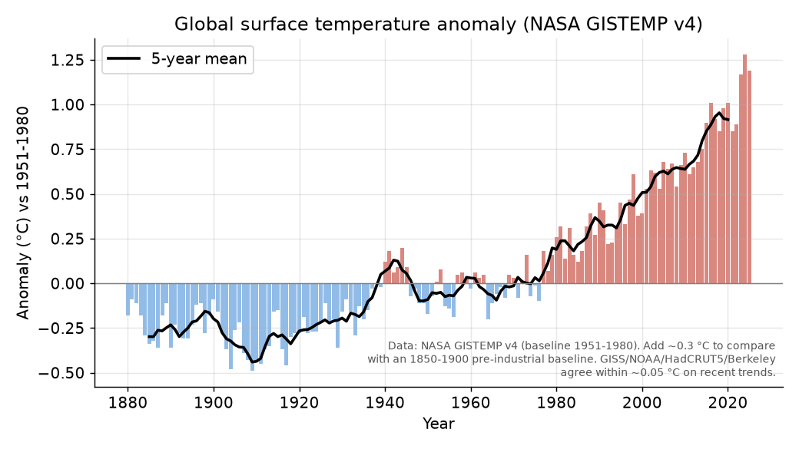

**Figure 2.** Global surface temperature anomaly, NASA GISTEMP v4 (baseline
1951–1980). The 5-year mean (black) shows the mid-century plateau (aerosol cooling
partly offsetting greenhouse warming) and the steep, sustained rise since ~1975.

### 3.2 Sea level

Global mean sea level (GMSL) rose ≈ **0.20 m over 1901–2018** (AR6). The rate is
not constant — it is **accelerating**: ≈1.3 mm/yr (1901–1971) → 1.9 mm/yr
(1971–2006) → **3.7 mm/yr (2006–2018)**. Figure 3, built from the century-long
CSIRO tide-gauge reconstruction, shows the acceleration directly (early-century vs
late-century linear fits).

*Uncertainty and bias.* Two regimes: pre-1993 tide gauges (sparse, needing
glacial-isostatic-adjustment and vertical-land-motion corrections) and post-1993
satellite altimetry (near-global, ~0.3–0.4 mm/yr uncertainty on the rate). The DOE
report correctly notes that *local relative* sea level at places like the Louisiana
coast is dominated by **land subsidence** (groundwater/hydrocarbon extraction,
sediment starvation), not ocean rise — at Grand Isle the relative rise is ~4× the
absolute climate signal. This is true and important for adaptation planning, but it
is a *local* modifier: it does not reduce the globally averaged, satellite-measured
climate signal. Conflating the two is a scope error (§6).

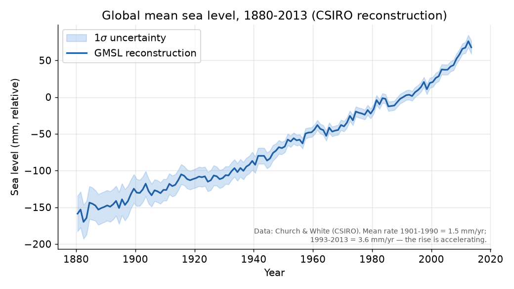

**Figure 3.** Global mean sea level, 1880–2013 (Church & White / CSIRO
reconstruction), with 1σ envelope. The rate roughly triples from the early 20th
century to the satellite era.

### 3.3 Ocean acidification

The surface ocean has absorbed 20–30% of anthropogenic CO₂, lowering surface pH by
**≈0.017–0.027 units per decade**; the acidification signal has now emerged over
>95% of the ocean surface (SROCC). Surface pH has fallen from ≈8.2 (pre-industrial)
to ≈8.05 — a ~30% increase in hydrogen-ion concentration, because pH is
logarithmic.

*The honest framing.* Contrarians (the DOE report included) note the ocean remains
alkaline (pH > 7) and prefer "neutralization." Chemically the water is indeed still
basic — but that is a semantic point, not a rebuttal. Mathematics settles it
(Principle 6): a 0.1-unit pH drop *is* a ~26% rise in [H⁺] by definition
(10^0.1 ≈ 1.26). What matters biologically is the **rate**: the current
decadal-scale change is orders of magnitude faster than the million-year natural
buffering by ocean sediments, and rapid pH drops accompany every mass-extinction
event for which we have reconstructions. The dispute is about consequences and
framing, not about the direction or the arithmetic.

### 3.4 Ocean warming

The ocean has absorbed **>90% (≈91%)** of the excess heat trapped by the enhanced
greenhouse effect (AR6 WGI; SROCC). This makes ocean heat content (OHC) the single
most reliable indicator of planetary energy imbalance — it integrates over the
noise that makes surface air temperature jump around year to year.

*Uncertainty and bias.* OHC has the **smallest relative uncertainty** of the major
indicators (deep, well-mixed water; the Argo float array since ~2005 gives dense,
consistent sampling). Figure 4 shows the 0–2000 m record; the linear trend
corresponds to a planetary imbalance of order **~0.5–0.8 W/m²** averaged over
Earth's surface — the number that, more than any surface thermometer, says the
system is accumulating energy. There is no credible account in which the ocean
warms this steadily and the planet is not gaining heat.

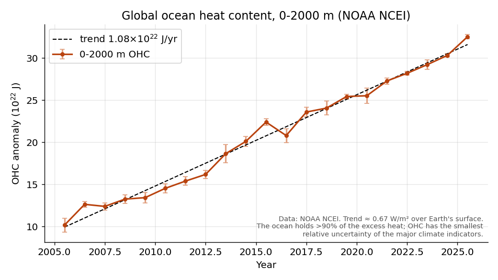

**Figure 4.** Global ocean heat content anomaly, 0–2000 m (NOAA NCEI), with 1σ
error bars. Because water's heat capacity dominates the climate system, this curve
is the cleanest fingerprint of the energy imbalance.

### 3.5 CO₂ and other atmospheric gases

The three principal long-lived greenhouse gases have all risen sharply and roughly
synchronously (Figure 5):

| Gas | Pre-industrial | 2019 (AR6) | Recent | Increase |
|-----|---------------:|-----------:|-------:|---------:|
| CO₂ | 280 ppm | 410 ppm | >430 ppm (2025) | +50% |
| CH₄ | 722 ppb | 1866 ppb | ~1930 ppb | +160% |
| N₂O | 270 ppb | 332 ppb | ~338 ppb | +25% |

*Attribution of the rise itself is not in serious dispute*, even among most
critics. The isotopic signature (falling ¹³C/¹²C ratio, the "Suess effect"), the
declining atmospheric O₂, and the simple fact that humans emit roughly twice what
accumulates (the ocean and land absorb the rest — the "airborne fraction" of ≈45%)
together make the human origin of rising CO₂ about as settled as anything in the
field.

The **radiative forcing** from these gases is computed from line-by-line
absorption spectra. Notably, even William Happer's own radiative-transfer
calculations reproduce the mainstream instantaneous forcing for doubled CO₂
(≈3.7 W/m²); his disagreement is about feedbacks and net harm, not the forcing.
That is worth stating clearly, because it locates the real debate.

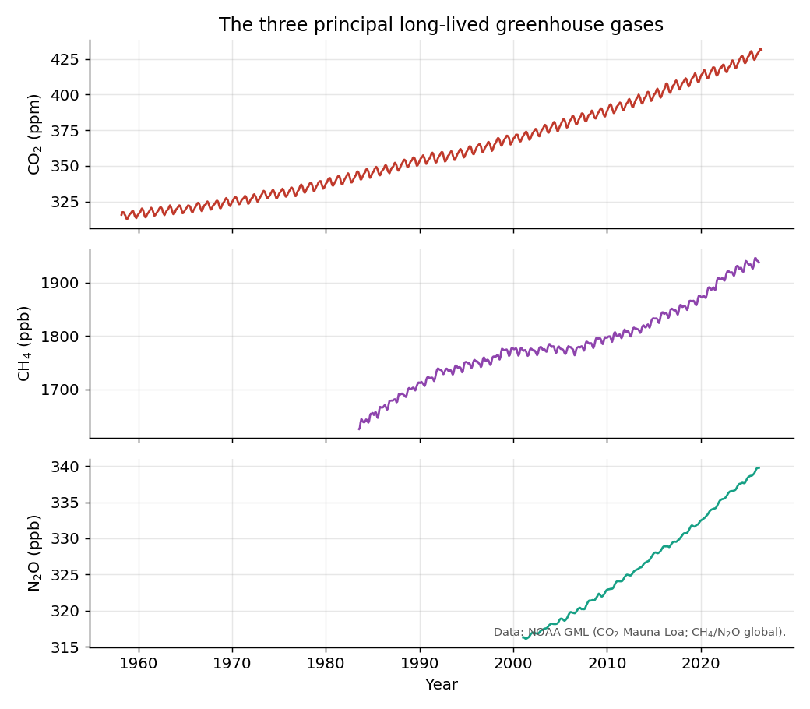

**Figure 5.** CO₂, CH₄, and N₂O (NOAA GML), each on its own scale. Different
sources — fossil fuels, agriculture and energy, fertilizer and industry — yet a
common anthropogenic upswing.

---

## 4. Attribution: what is settled, what is open

Honest reporting requires separating the two.

**Settled (very high confidence).**
- CO₂, CH₄, N₂O are greenhouse gases; their rise is human-caused. *(Undisputed even
  by the credentialed critics.)*
- Human influence is the dominant cause of observed warming since ~1850. AR6's best
  estimate of human-caused warming (1850–1900 to 2010–2019) is **1.07 °C**, against
  total observed warming of ~1.1 °C — i.e. essentially all of it. IPCC calls this
  "unequivocal."
- Warming is **near-linear in cumulative CO₂**: every 1000 GtCO₂ raises temperature
  ≈ **0.45 °C [0.27–0.63]** (the Transient Climate Response to cumulative Emissions,
  TCRE; Figure 6). This is why *net-zero CO₂* is a physical requirement for halting
  warming, not a political slogan.

**The fingerprints.** Attribution does not rest on the temperature curve alone; it
rests on a pattern of signatures that a greenhouse cause predicts and alternatives
(a brighter Sun, say) do not. The **stratosphere is cooling while the troposphere
warms** — the hallmark of greenhouse trapping, and the opposite of what solar
forcing would produce (a brighter Sun warms both layers). **Nights are warming
faster than days**, and **winters faster than summers**, as expected when the
limiting factor is outgoing infrared rather than incoming sunlight. The
**tropopause has risen**, the upper atmosphere has contracted, and more infrared is
measured returning to the surface at the specific wavelengths CO₂ absorbs. These
independent fingerprints are why "it's the Sun" fails quantitatively: solar
output has been flat-to-slightly-declining since the 1980s while warming
accelerated, and the vertical structure of the change is wrong for a solar cause.

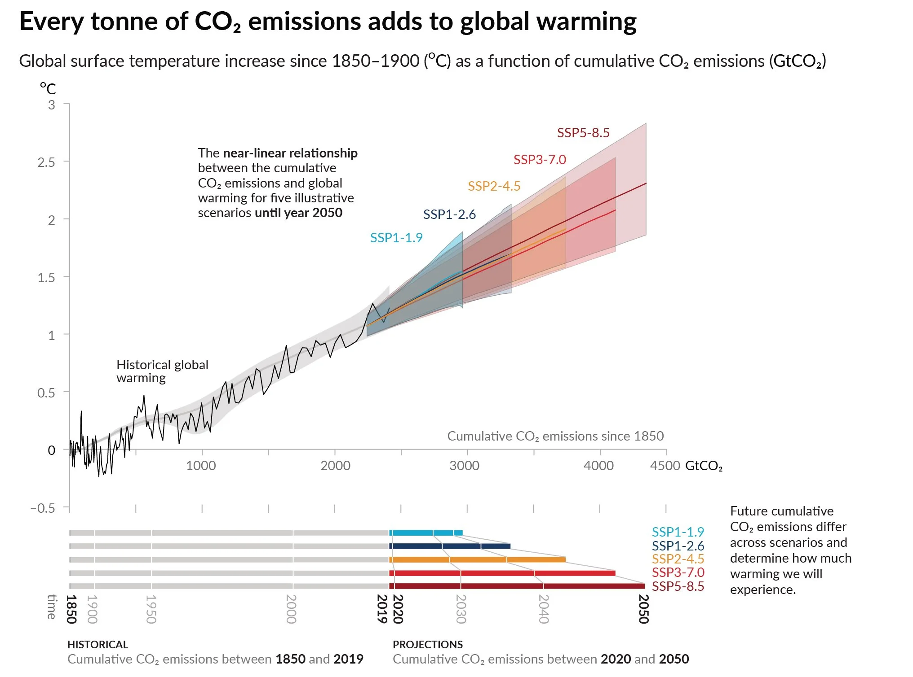

**Figure 6.** "Every tonne of CO₂ emissions adds to global warming" — global surface
temperature increase since 1850–1900 as a function of cumulative CO₂ emissions,
showing the observed historical record (black) and the near-linear TCRE relationship
extended to 2050 under five illustrative SSP scenarios, with their assessed
uncertainty ranges (shaded). Reproduced from IPCC AR6 WG1 Figure SPM.10 (IPCC 2021),
as presented on the Environmental Graphiti page "Emissions Levels Determine
Temperature Rise," where the figure is paired with a digital artwork derived from it
(environmentalgraphiti.org).

**Genuinely open (the honest uncertainties).**
- **Equilibrium climate sensitivity (ECS)** — warming per CO₂ doubling. AR6
  assesses **3 °C [likely 2.5–4.0]**, narrowed from the Charney 1.5–4.5 by combining
  process, historical, and paleoclimate evidence (Sherwood et al. 2020). The upper
  tail is what drives worst-case risk and remains poorly constrained.
- **Cloud feedbacks** — the largest single source of ECS spread. This is the real
  scientific frontier, and it is where the strongest heterodox arguments live.
- **Regional and extreme-event detection** — signal emerges later at smaller scales;
  AR6 detects an anthropogenic signal with high confidence in only a subset of the
  ~33 climate-impact-driver categories.

**The strongest heterodox challenges, weighed (Principle 2).**
- *Lindzen's "iris" hypothesis* (tropical cirrus contract with warming → strong
  negative feedback → low ECS). Tested repeatedly (Hartmann & Michelsen 2002; Lin
  et al. 2002) and not supported at the strength claimed; a weak version may exist
  (Mauritsen & Stevens 2015) but not enough to yield low sensitivity.
- *Christy & Spencer's tropical-troposphere gap* (models warm the tropical
  troposphere ~2× faster than satellites/balloons show). This discrepancy is
  **real and acknowledged in AR6** — the honest open question is its magnitude and
  cause. Santer et al. (2017) shrink it to ~1.7× after accounting for stratospheric
  contamination and dataset uncertainty; Po-Chedley et al. (2021) attribute much of
  the remainder to internal variability rather than excess model sensitivity. The
  UAH satellite record's own history — two major errors (orbital-decay 1998,
  diurnal-drift sign 2005) found by outside groups, both of which had *masked*
  warming — is a caution about treating any single dataset as ground truth.
- *Lewis & Curry's low ECS* (energy-budget estimates, ~1.5–1.8 °C). Legitimate,
  peer-reviewed, and taken seriously — but shown to be biased low by "pattern
  effects" (the historical warming pattern differs from the equilibrium pattern);
  Sherwood et al. (2020) find values below 2 °C hard to reconcile with any single
  line of evidence, let alone all three.

The pattern across these: the critics' **data** have generally survived scrutiny
better than the **inferences** drawn from them. Their existence is healthy;
Principle 2 means engaging them on the evidence, which is what the field has done.

---

## 5. Future projections

Projections are scenario-conditional: they answer "if emissions follow path X,
then…", and the range reflects both scenario spread and physical uncertainty.

**Warming by 2081–2100 (vs 1850–1900), AR6 very likely ranges:**

| Scenario | Description | Warming (°C) |
|----------|-------------|-------------:|
| SSP1-1.9 | aggressive mitigation | 1.4 [1.0–1.8] |
| SSP1-2.6 | strong mitigation | 1.8 [1.3–2.4] |
| SSP2-4.5 | "middle of the road" | 2.7 [2.1–3.5] |
| SSP3-7.0 | high emissions | 3.6 [2.8–4.6] |
| SSP5-8.5 | very high emissions | 4.4 [3.3–5.7] |

**A caveat both camps now share.** The highest scenario, SSP5-8.5 (formerly
RCP8.5), was widely and wrongly used as "business as usual" in the impacts
literature. It is better read as a low-probability high-end, not a baseline. This
is a point on which mainstream analysts (Hausfather & Peters 2020) and critics
(Pielke & Ritchie) actually agree — and a good example of the blog correcting a
genuine distortion without ceding the underlying science. Current policies point
to roughly **2.6–3.2 °C**; current pledges (NDCs), to ~2.3–2.8 °C — better than a
decade ago, still short of the Paris goals.

**The carbon-budget arithmetic (Principle 6).** From the TCRE relation and ~2400
GtCO₂ already emitted, the remaining budget for a 50% chance of holding 1.5 °C was
~500 GtCO₂ as of 2020 and, after ~40 GtCO₂/yr since, is now of order ~150–200
GtCO₂ — a few years at current rates. The math is unforgiving and does not depend
on any contested feedback: it follows from the near-linear, well-observed part of
the physics.

**Irreversibility and tails.** Some changes (deep-ocean warming, ice-sheet loss,
sea-level rise) are effectively irreversible on human timescales; committed sea-level
rise is measured in metres over centuries even at 1.5 °C. Low-probability,
high-impact outcomes (ice-sheet collapse, circulation changes) cannot be excluded
and belong in risk assessment precisely *because* Principle 5 cuts both ways: a low
probability is not zero, and a high-impact tail carries weight even when unlikely.

---

## 6. Biodiversity and the living planet

Climate is only half the story. The blog's purview and its third guiding
principle — *all life on Earth is relevant; human life need not be prioritized* —
demand that a state-of-the-Earth report also account for the biosphere. The
physical climate and the living world are two coupled crises, and the biodiversity
side has its own hard numbers, its own uncertainties, and its own honest debate.

**The scale, in biomass.** Measured as dry carbon, life on Earth totals ≈550 Gt C,
and it is overwhelmingly vegetation: **plants ≈450 Gt C (~80%); all animals ≈2 Gt C
(~0.4%)** (Bar-On, Phillips & Milo 2018). Within that thin animal layer, one species
and its livestock now dominate. Wild land mammals amount to only ≈20 Mt (wet), about
**3 kg per person alive**, against ≈390 Mt of humans and ≈630 Mt of livestock
(Greenspoon et al. 2023) — **more than 50 kg of humans and domesticated animals for
every 1 kg of wild land mammal.** Since the rise of civilization, human activity has
roughly **halved** global plant biomass and cut wild land-mammal biomass **~7-fold**.
Barnosky (2008) gives the mechanism: net primary productivity sets an energetic
ceiling on large-animal biomass, and human expansion has spent that budget at wild
megafauna's expense — today's overshoot of the natural ceiling is underwritten by
the same fossil-energy subsidy that drives the carbon problem (§4).

**A sixth mass extinction — onset, not completion.** Here the principles about
statistics (5) and fact-with-uncertainty (1) matter most. A *true* mass extinction,
in the paleontological sense, means losing **>75% of species** in a geologically
brief interval; that has happened exactly **five times in ~540 million years**. By
that strict bar we are **not there** — documented losses are ~1–2% of species in
well-studied groups (Barnosky et al. 2011), rising to a contested ~7.5–13% once the
barely-assessed invertebrates are included (Cowie et al. 2022, set against the IUCN
Red List's formally documented 0.04%). What is *not* in serious dispute is the
**rate**: modern extinctions run **~100–1,000× the geological background**, ≈114×
for vertebrates under deliberately conservative assumptions (Ceballos et al. 2015).
At sustained current rates the 75% threshold would arrive within roughly 3–22
centuries. The honest statement is therefore: **we are plausibly at the onset of a
sixth mass extinction, not in a completed one** — a trajectory, not yet an event.

The nearer-term signal is population decline (defaunation) rather than final
extinction: across ~71,000 species, **48% are declining, 49% stable, 3% increasing**,
and about a third of species the IUCN classes as *non-threatened* are nonetheless
shrinking (Finn et al. 2023). Losers outnumber winners roughly 16 to 1.

**The debate, fairly stated (Principle 2).** Critics note that the dramatic
multipliers rest on extrapolation, on IUCN data with taxonomic and geographic gaps,
and on island faunas whose extinction rates exceed continents'; a rebuttal
literature argues the framing outruns the hard data. But the same under-assessment
cuts the other way — because invertebrates and plants are so poorly catalogued, the
official counts likely *understate* losses. The disagreement is genuine but narrow:
it is about whether the strict definition is *yet* met, not about whether
human-caused biodiversity loss is severe and accelerating (it is).

**Where climate fits.** Per the IPBES Global Assessment (2019), the drivers rank:
(1) land- and sea-use change, (2) direct overexploitation, (3) **climate change**,
(4) pollution, (5) invasive species. Climate change is currently a *secondary*
driver but the fastest-accelerating one, and it compounds the others — warming
degrades ecosystems that store carbon, while habitat destruction removes sinks.
IPBES estimates ~**1 million species** threatened with extinction. For the blog,
the accurate synthesis is that the biodiversity crisis was set in motion mainly by
land use, hunting, and invasives, and that climate change is the rising tide that
threatens to carry it from onset toward a true mass extinction.

*(Some writers — e.g. the physicist Tom Murphy — read this biomass collapse as the
biological expression of the same growth-beyond-limits that drives the energy and
carbon problems, and frame it through Daniel Quinn's decentering of the human. That
is a viewpoint to engage, not data; this report keeps the peer-reviewed numbers
above distinct from any such framing, per Principles 2 and 4.)*

---

## 7. Homelessness: evidence, policy, and the climate connection

*(Added 2026-07-11. Homelessness enters this report as one of the blog's
"related topics," and it earns the place twice over: the unhoused are the most
climate-exposed people in the country, and the subject is a rare social-policy
question where a genuine randomized controlled trial exists — terrain where
Principles 1, 2 and 5 apply exactly as they do to climate data.)*

**What the strongest evidence shows.** The Denver Supportive Housing Social
Impact Bond Initiative (2016–2020) is the closest thing American homelessness
policy has to a laboratory experiment: **724 chronically homeless people** with
frequent police and jail contact were randomly assigned to an offer of permanent
supportive housing — an apartment plus intensive services, with *no*
preconditions of sobriety or treatment ("housing first") — or to usual care
(Urban Institute RCT). Of those offered housing, **79% were successfully housed
from the streets**, and among the living, **86% remained housed at one year, 81%
at two, 77% at three**. Relative to control, participants logged **34% fewer
police contacts, 40% fewer arrests, 27% fewer jail days, 40% fewer shelter
visits, and 65% fewer detox visits**; emergency medical use showed no
statistically significant difference. The program cost roughly **$22,000–36,000
per person-year**, of which **about half was offset** by avoided jail, court,
shelter, and detox costs (~$7,000/yr less in emergency services per person).

At city scale, Houston is the observational counterpart (NYT, Kimmelman &
Tompkins 2022): one lead agency coordinating >100 providers with shared
real-time data moved **>25,000 people (now >36,000) directly into housing from
2012**, cut the regional count **~63% from 2011**, and cut veterans'
street-to-housing time from **720 days to 32**; roughly **90% remain housed or
positively exited at two years**. Nationally, Finland — the one country to adopt
housing first as state policy (2008) — cut long-term homelessness by more than
two-thirds, with estimated public savings of €9,600–15,000 per person-year.

**What the evidence does *not* show, stated fairly (Principle 2).** Housing
first demonstrably *houses* people; it has not been shown to *heal* them. The
National Academies (2018) found no substantial published evidence that
permanent supportive housing improves health outcomes, and Denver's null EMS
result is consistent with that. Critics add real quantitative points: Corinth
(AEI) estimates ~10 supportive-housing units reduce point-in-time homelessness
by ~1 person, and showed Utah's celebrated "91% reduction" was largely a
definitional artifact; the Cicero and Manhattan Institutes argue the model
became a federal funding monopoly that crowded out treatment. Defenders reply
that housing first's endpoint is housing stability, not sobriety, and that the
2013–2024 national rise tracks rents, opioids, and a pandemic, not the model.
Both of these can be true. The disciplined statement is: **housing first wins
decisively on housing retention and public-system churn; its health effects are
unproven; and no housing policy can outrun a shortage of affordable housing.**

**The scale of the problem, and the policy reversal.** The January 2024
point-in-time count found a record **771,480** people homeless on one night
(+18% yr/yr — housing costs, expiring pandemic aid, migration); January 2025
counted **745,652 (−3.4%)**, the first decline since 2016. Meanwhile policy
moved sharply against the evidence base described above: *Grants Pass v.
Johnson* (June 2024) allowed enforcement of camping bans regardless of shelter
availability (14 states and 350+ cities have since toughened laws), and
Executive Order 14321 (July 2025) pivoted federal funding from permanent
housing toward mandated treatment and transitional programs, capping
permanent-housing uses at 30% of ~$3B in HUD grants (20 states + DC are suing).
Houston itself, its COVID funds spent, saw unsheltered homelessness rise 16% in
2025 — a live natural experiment in whether a proven system survives its
funding cliff.

Two features of the numbers matter for any policy read (Figures 10 and 11).
First, the *national* trajectory is not a steady climb: homelessness fell for
most of the 2010s to a **2016 low of ~550,000**, then rose sharply to the 2024
record — the surge is recent and tracks the affordable-housing squeeze and the
end of pandemic aid, not a secular trend (Figure 10). Second, homelessness is
**intensely geographic**: the 2024 rate ranges from ~80 per 10,000 in Hawaii,
DC, and New York down to ~3.5 in Mississippi — a **23-fold spread** that follows
housing costs far more than any regional difference in addiction or mental
illness (Figure 11). This within-country variation is itself evidence for the
housing-supply thesis.

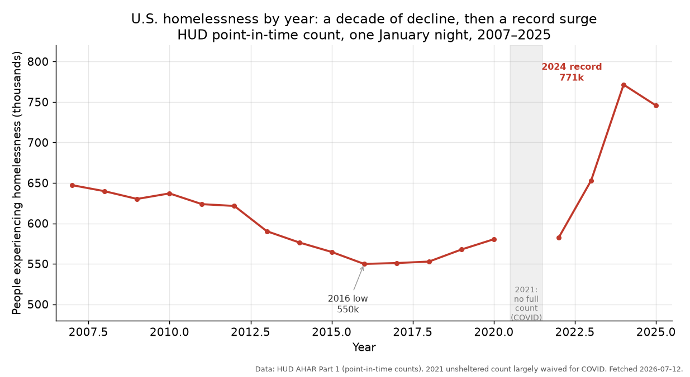

**Figure 10.** U.S. people experiencing homelessness by year (HUD point-in-time
count), 2007–2025: a decade-long decline to a 2016 low, then a record surge to
771,480 in 2024. 2021 had no full count (COVID). Source: HUD AHAR Part 1.

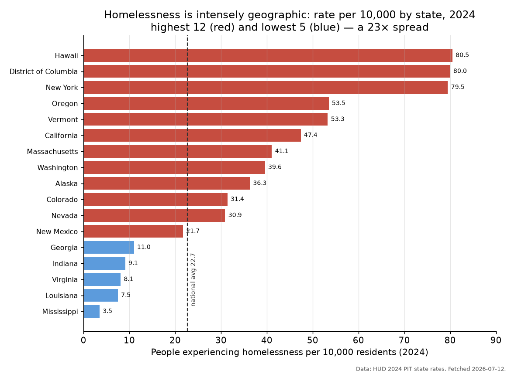

**Figure 11.** Homelessness rate per 10,000 residents by state, 2024 — the
highest twelve (red) and lowest five (blue), with the national average (22.7)
marked. The ~23× spread tracks housing costs. Source: HUD 2024 PIT.

**Where climate enters.** (1) *Exposure:* the unhoused are <1% of Maricopa
County's population but roughly **40–50% of its heat deaths** (339 heat deaths
in 2021; ~430 in 2025) — heat, the deadliest U.S. weather hazard (§3.1's warming
trend made tangible), kills the unsheltered at ~100× the general rate. (2)
*Supply destruction:* disasters delete exactly the low-cost housing stock that
homelessness systems depend on — the 2018 Camp Fire alone destroyed ~15,000
homes and displaced ~50,000 people (only ~10% returned within a year); Maui
2023 and the January 2025 Los Angeles fires repeated the pattern in tighter
markets. (3) *Displacement:* climate is now the second-largest driver of
displacement globally, after conflict. The synthesis for the blog: a
housing-first continuum is climate-adaptation infrastructure, and the climate
and housing crises compete for — and destroy — the same scarce, cheap housing.

**What would it cost to house everyone? (a back-of-envelope, done honestly).**
*(Estimate revised 2026-07-13 after a quantitative critique — see below.)* The
evidence supports a rough national estimate, and the number is smaller than most
readers expect — but it splits into two genuinely different questions. Take the
point-in-time homeless population (**771,480** in Jan 2024, HUD's record),
divided into the **152,585 chronically homeless** (who need **permanent
supportive housing** — rent subsidy *plus* intensive services, the model the
Denver and Canadian RCTs tested) and the remaining ~619,000 (who need the
cheaper, time-limited **rapid re-housing**).

- *"Put a roof over everyone" (housing subsidy only).* A rent voucher runs
  ~\$11,000/person-year (Denver's housing payment was ~\$10,950; RRH is already
  mostly rent at ~\$8,500). This narrow question costs **≈ \$7–16 billion/year
  (central ≈ \$10 billion)**.
- *Housing **plus** services (what buys retention and the offsets).* Adding
  intensive services for the chronic group (PSH all-in \$20,000–36,000) gives a
  gross of ≈ \$8–22 billion; because supportive housing offsets ~40–60% of its
  cost through avoided jail, ER, shelter, and detox use (Denver ~\$7,000/person-
  year), the **net is ≈ \$6.5–19 billion/year (central ≈ \$11 billion)**.

Both land near the National Alliance to End Homelessness's independent
\$9.6 billion estimate — a reassuring cross-check. To put ≈\$11 billion/year in
proportion, against three honest denominators: about **\$32 per U.S. resident**,
**\$54 per working-age adult**, or **\$93 per federal income-tax payer** per
year — still, at the taxpayer level, roughly a tank of gas.

Four caveats are load-bearing, not decorative (Principle 1), and the last two
can *raise* the bill materially:
1. **This is an operating subsidy, not construction.** Vouchers do not create
   apartments, and the U.S. has a housing *shortage* — so in tight markets you
   cannot house people without **building units**. Development runs
   ~\$200k/unit (lower-cost markets) to ~\$550k/unit (California). Building even
   the 152,585 chronic units would be a **one-time ~\$30–84 billion** (≈\$1–3
   billion/year amortized over 30 years); building for the whole PIT population
   would be **~\$150–420 billion** one-time (≈\$5–14 billion/year amortized).
   Much of the population can be housed in *existing* units via vouchers, so the
   true build need is a fraction of that — but where supply is the binding
   constraint (California, coastal metros) this capital cost, not the voucher,
   is the real bill.
2. **The population is not fixed.** The single-night count understates the
   **~1.25 million** who use shelter across a full year (HUD AHAR Part 2), and a
   standing offer of housing plausibly induces some additional take-up. Costing
   the annual-flow population instead pushes the services-inclusive net to
   **≈\$17 billion/year**. Targeting via vulnerability indices, and the stigma
   and "trapped-population" evidence, bound how large that induced demand can
   be — but it is a real upward risk.
3. **Marginal costs rise with scale.** These are costs *at current average
   rates*, from pilots of a few hundred people; scaling to hundreds of thousands
   in supply-constrained markets bids up rents and reaches harder-to-house
   cases. The model applies a 1.0–1.35× marginal-cost multiplier, but the true
   curve is unknown — treat the figures as a **floor**.
4. Dollar figures mix 2022–2025 vintages and are not inflation-harmonized.

The headline is deliberately a **range, not a point**, and the honest
bottom line survives the caveats: the recurring *operating* cost of housing the
homeless is a small federal line item (single-digit-to-low-double-digit
billions, tens of dollars per taxpayer), while the *capital* cost of the missing
housing is the larger and more uncertain number — which is exactly why "the
binding constraint is housing, not the model" recurs throughout this section.

**How other developed nations respond.** The United States is not running this
experiment alone, and the international record sharpens the lesson: the
*intervention* (Housing First) has now been validated by randomized trials on
three continents, but *outcomes at national scale* depend on pairing it with
housing supply and sustained funding — which most countries have not done.

- **Finland — the standout.** Alone among developed nations, Finland has
  *ended* street homelessness and driven long-term homelessness down by roughly
  **75% since the late 1980s**, and it is the only EU country where homelessness
  is still falling. The mechanism is Housing First as *national policy* since
  2007–08: shelters converted to permanent apartments, the state-backed
  Y-Foundation acquiring scattered-site housing, and — decisively — actual
  housing supply. The Y-Foundation estimates each person housed saves social,
  health, justice, and emergency services about **€15,000 per year**, the same
  offset logic the Denver and Houston numbers show.
- **Canada — the RCT that mirrors Denver.** The **At Home/Chez Soi** trial
  (2009–13, >2,000 participants with mental illness across five cities) was, at
  the time, the largest randomized controlled trial of Housing First ever run.
  It found the same result as Denver: for high-needs participants, savings in
  shelters, hospitals, and jails offset about **69%** of the program cost
  (roughly CAD $20,000 → net ~$6,300 per person-year), against a societal cost
  of leaving someone homeless-and-mentally-ill of ~CAD $75,000/year. Canada
  built the evidence into its national **"Reaching Home"** strategy.
- **France — cost fully offset.** The **"Un Chez-Soi d'Abord"** randomized trial
  reported **~85% still stably housed at two years**, with program costs
  **fully offset** by reduced hospitalization and shelter use; France scaled it
  from four pilot cities to 40+ cities (3,000+ places) under a national
  *"Logement d'abord"* plan.
- **Norway** halved homelessness after 2012 through a sustained, coordinated
  housing-and-services strategy — a second national success story alongside
  Finland.

The counter-cases are as instructive as the successes. **Denmark** adopted
Housing First nationally in 2009 and gets good *individual* outcomes, yet total
homelessness *rose* — especially youth homelessness — because the affordable-
housing supply did not keep pace. **Germany** crossed **~1,029,000 people
without housing in 2024** (the first time above a million, per the BAGW), with
excellent but tiny Housing First pilots (Berlin reports >90% retention across a
few hundred people) swamped by a national shortage. Across the continent,
**FEANTSA's 2024 overview counts on the order of ~900,000 people homeless on a
given night in the EU** (over 1.2 million including temporary accommodation in
Europe), with homelessness having **roughly doubled in France and Germany over
a decade**. All EU states signed the 2021 **Lisbon Declaration** pledging to end
homelessness by 2030; on current trends only Finland is on track.

The synthesis for the blog: the Denver/Houston finding generalizes — Housing
First reliably houses people and pays back much of its cost in avoided
emergency services, confirmed by RCTs in Canada and France. But it is *not*
self-executing. Where a country adds housing supply and funds the model at
scale (Finland, Norway), homelessness falls; where it runs Housing First as a
pilot atop a housing shortage (Denmark, Germany, much of the US), the
individual program works while the national numbers rise. The binding
constraint is housing, not the model — the same lesson the U.S. cost estimate
flagged.

Cross-country *rate* comparisons (Figure 12) must be read with real caution —
there is no harmonized international definition, and some countries count only
rough sleepers while others include shelters, institutions, or people staying
with friends. Within that limit, the consistent-methodology picture still shows
Finland at the low end of its peers and confirms that the rate is a policy
outcome, not a fixed national trait. Broad-definition counts (Germany's ~1.03
million, which includes refugees and institutional housing; France's wide
count) are deliberately omitted from the figure to avoid a false comparison —
itself an illustration of Principle 1: the number is only as meaningful as its
definition.

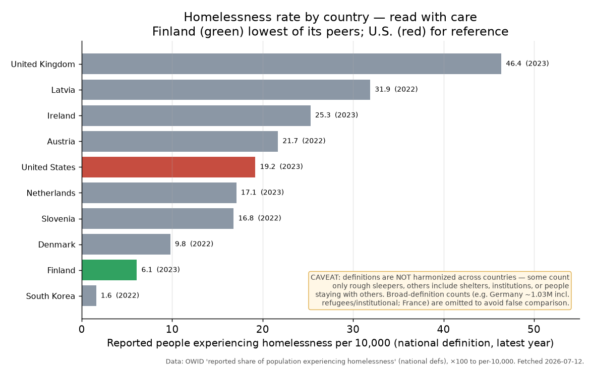

**Figure 12.** Reported homelessness rate per 10,000 by country (each country's
own national definition, latest year) — Finland (green) lowest among its peers,
the U.S. (red) for reference. The prominent caveat is part of the figure:
definitions are not comparable across borders, so this ranks *reported* rates,
not a clean like-for-like. Source: OWID "reported share of population
experiencing homelessness."

---

## 8. Global population: the *P* in every projection

*(Added 2026-07-11. Population is a direct input to every emissions scenario —
the first factor of the Kaya identity — and the denominator of every per-capita
number this blog will ever quote. It is also the rare global projection with
genuinely small near-term uncertainty: people who will be 30 in 2056 have
already been born.)*

**The century behind us.** World population stood near **2 billion in 1927**
and reached **8 billion in 2022** — a quadrupling within one long human
lifetime (Figure 7). The 2→4 billion and 4→8 billion doublings each took ~48
years. The driver is the **demographic transition**: mortality falls first
(global life expectancy ~32 years in 1900, 73.3 in 2024 [38]), population
surges, then fertility follows education, urbanization, and contraception
downward. The global total fertility rate has fallen from **~5 births per
woman in the early 1960s to 2.25 in 2024** — just above the replacement level
of 2.1 — and more than half of all countries are now below replacement
(Figure 9). Crucially, the *rate* of growth peaked sixty years ago: **~2.1%/yr
around 1964**, halved to ~0.85%/yr today; absolute additions peaked at ~92
million/yr around 1988 (Figure 8). Growth has been decelerating for two full
generations — the "population bomb" of 1968 vintage never detonated on
schedule, defused by choices made mostly by educated women.

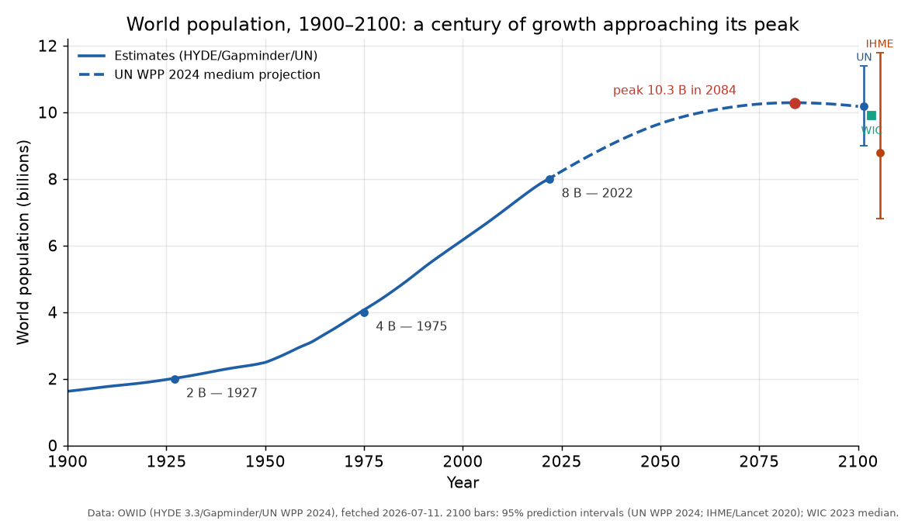

**Figure 7.** World population, 1900–2100: estimates (HYDE/Gapminder/UN),
the UN WPP 2024 medium projection (dashed), billion-crossing milestones
computed from the series, and the spread of end-of-century projections with
95% intervals (UN 9.0–11.4 B; IHME 6.8–11.8 B; WIC median 9.9 B).

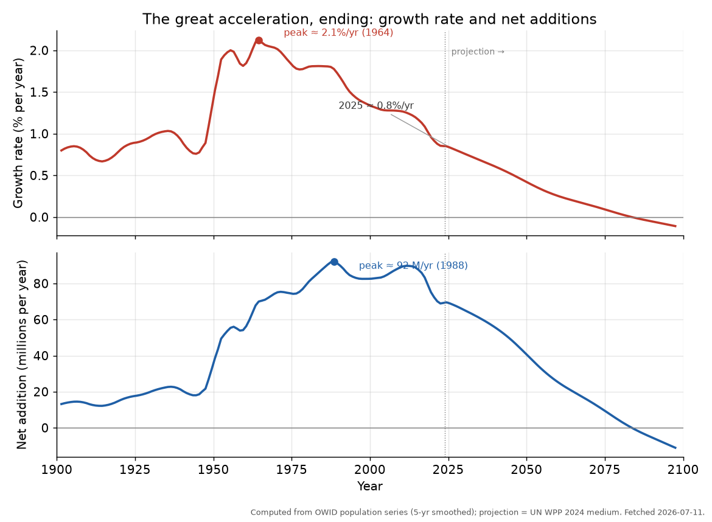

**Figure 8.** The growth *rate* (top) peaked around 1964 at ~2.1%/yr; net
annual additions (bottom) peaked around 1988 at ~92 million/yr. Under the UN
medium projection both cross zero in the mid-2080s.

**Projections, with uncertainty stated (Principle 1).** The UN's *World
Population Prospects 2024* medium scenario reaches 8.5 B in 2030, 9.7 B in
2050, a **peak of ~10.3 B in the mid-2080s** (medium-series maximum 10.29 B in
2084), then 10.2 B by 2100 with a 95% prediction interval of **9.0–11.4 B**
[38]. The UN now assigns **80% probability that world population peaks within
this century** — up from ~30% a decade ago; its 2100 estimate has come down
~700 million (6%) in ten years, mainly on faster-than-expected fertility
declines in China and parts of sub-Saharan Africa. Independent groups agree on
the shape and differ on timing: IHME (Lancet, 2020) projects a **peak of 9.7 B
in 2064 falling to 8.8 B [6.8–11.8] by 2100** [39]; the Wittgenstein Centre
(2023) gives 9.9 B in 2100 [40]. A projection without its range is not a
scientific statement, and Figure 7 plots all three ranges; but the qualitative
conclusion — *human population growth ends this century* — is now the
consensus of every major forecasting group.

The composition shifts as much as the total. **One in four people already
lives in a country whose population has peaked** (63 countries including
China — peaked 2021 — Japan, Germany, Russia); India passed China in 2023.
**79% of the growth remaining to 2054 is demographic momentum** — embedded in
today's young age structure, arriving even at replacement fertility. Nearly
all net growth concentrates in 126 still-growing countries; **sub-Saharan
Africa rises from 1.2 B (2024) to 2.2 B by 2054 and ~3.3 B [2.7–4.5] by
2100** [38]. And the world ages: by the late 2070s people 65 and older
(~2.2 B) are projected to outnumber children under 18.

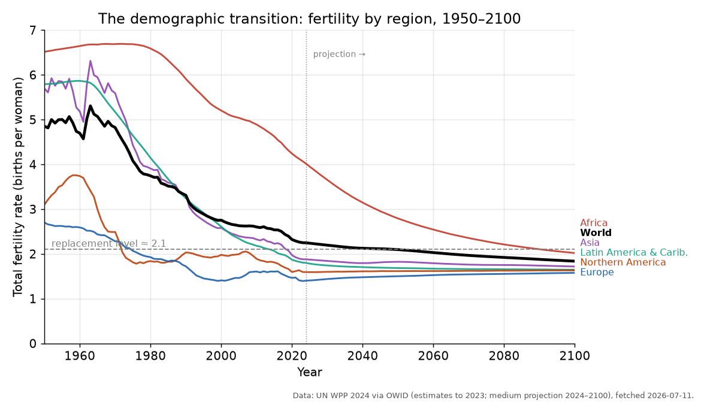

**Figure 9.** Total fertility rate by region, 1950–2100 (UN WPP 2024
estimates + medium projection). Every region converges toward or below the
replacement level of ~2.1; Africa is simply the latest to make the same
transition.

**Population and climate, decomposed (Principle 6).** The Kaya identity
factorizes emissions: CO₂ = P × (GDP/P) × (energy/GDP) × (CO₂/energy). From
1965 to 2022, population grew **+140%** while emissions grew **+230%**:
affluence (+179% GDP per capita) outpaced headcount as a multiplier, and the
two intensity terms (−50%, −15%) absorbed part of both [41]. Two corollaries
keep the analysis honest. First, *the growth is where the emissions are not*:
sub-Saharan Africa, with the fastest population growth, emits ~0.8 tCO₂ per
person per year against ~14 for the United States — the next two billion
people add far less carbon than the last two billion did, unless incomes rise,
which is the development-equity tension of WGIII in a single sentence. Second,
an earlier, lower peak modestly eases long-run pressure on food, housing, and
energy demand — the UN's own summary notes as much — but scenario work puts
the demographic lever well below the energy-system levers this report covers
in §5. The UN's framing is the right editorial anchor: *"a sustainable future
for all hinges more on human behaviours than on human numbers"* [38] — and the
interventions that lower fertility fastest (girls' education, voluntary family
planning, child survival) are development goods in their own right.

---

## 9. A note on scope and framing

Several of the sharpest disagreements are not about physics but about **scope**, and
recognizing this defuses much apparent contradiction:

- *Global vs. U.S.* "No trend in U.S. landfalling hurricanes" (true) is not
  "no trend in global hurricane intensity" (a different, global question).
- *Absolute vs. relative* sea level: local subsidence is real but does not shrink
  the global climate signal.
- *Level vs. rate*: high CO₂ in deep time does not bear on the danger of a fast
  modern rise.
- *Detection vs. attribution*: "not yet detected at this scale" is not "shown to be
  absent."

Keeping these distinctions crisp is most of what it takes to write about climate
accurately — and it is fully consistent with the purview's exclusion of politics:
these are questions of measurement and logic, not ideology.

---

## 10. References

*Primary assessments and data (full portals in `context/references.md`):*

1. IPCC, 2021. *Climate Change 2021: The Physical Science Basis* (AR6 WGI).
   Cambridge University Press.
2. IPCC, 2022. *Impacts, Adaptation and Vulnerability* (AR6 WGII).
3. IPCC, 2022. *Mitigation of Climate Change* (AR6 WGIII).
4. IPCC, 2023. *Climate Change 2023: Synthesis Report* (AR6 SYR).
5. IPCC, 2019. *Special Report on the Ocean and Cryosphere* (SROCC).
6. NOAA Global Monitoring Laboratory. Trends in atmospheric CO₂, CH₄, N₂O.
   https://gml.noaa.gov/ccgg/trends/ (data accessed 2026-07-09).
7. NASA GISTEMP Team, 2026. *GISS Surface Temperature Analysis v4*.
   https://data.giss.nasa.gov/gistemp/ (accessed 2026-07-09).
8. Church, J.A. & White, N.J., 2011. Sea-level rise from the late 19th to early
   21st century. *Surveys in Geophysics* 32:585–602 (CSIRO reconstruction; accessed
   2026-07-09).
9. NOAA NCEI. Global Ocean Heat Content, 0–2000 m (Levitus/WOA; accessed
   2026-07-09).
10. Sherwood, S. et al., 2020. An assessment of Earth's climate sensitivity using
    multiple lines of evidence. *Reviews of Geophysics* 58, e2019RG000678.
11. Hausfather, Z. & Peters, G., 2020. Emissions – the "business as usual" story is
    misleading. *Nature* 577:618–620.
12. Santer, B. et al., 2017. Comparing tropospheric warming in climate models and
    satellite data. *Journal of Climate* 30:373–392.
13. Lewis, N. & Curry, J., 2018. The impact of recent forcing and ocean heat uptake
    data on estimates of climate sensitivity. *Journal of Climate* 31:6051–6071.
14. U.S. Department of Energy Climate Working Group, 2025. *A Critical Review of
    Impacts of Greenhouse Gas Emissions on the U.S. Climate.*
15. Dessler, A. & Kopp, R. (eds.), 2025. *Climate Experts' Review of the DOE Climate
    Working Group Report.* ESS Open Archive.

*Biodiversity (§6):*

16. Bar-On, Y., Phillips, R. & Milo, R., 2018. The biomass distribution on Earth.
    *PNAS* 115(25):6506–6511.
17. Greenspoon, L. et al., 2023. The global biomass of wild mammals. *PNAS*
    120(10):e2204892120.
18. Barnosky, A.D., 2008. Megafauna biomass tradeoff as a driver of Quaternary and
    future extinctions. *PNAS* 105(Suppl. 1):11543–11548.
19. Barnosky, A.D. et al., 2011. Has the Earth's sixth mass extinction already
    arrived? *Nature* 471:51–57.
20. Ceballos, G. et al., 2015. Accelerated modern human-induced species losses:
    entering the sixth mass extinction. *Science Advances* 1(5):e1400253.
21. Ceballos, G., Ehrlich, P. & Dirzo, R., 2017. Biological annihilation via the
    ongoing sixth mass extinction. *PNAS* 114(30):E6089–E6096.
22. Cowie, R., Bouchet, P. & Fontaine, B., 2022. The Sixth Mass Extinction: fact,
    fiction or speculation? *Biological Reviews* 97(2):640–663.
23. Finn, C., Grattarola, F. & Pincheira-Donoso, D., 2023. More losers than winners:
    Anthropocene defaunation. *Biological Reviews* 98(5):1732–1748.
24. Smart, M.S. et al., 2023. The expansion of land plants during the Late Devonian
    contributed to the marine mass extinction. *Communications Earth & Environment*
    4:449.
25. IPBES, 2019. *Global Assessment Report on Biodiversity and Ecosystem Services.*
26. Kolbert, E., 2014. *The Sixth Extinction: An Unnatural History.* Henry Holt.
    (2015 Pulitzer Prize, General Nonfiction.)
27. Murphy, T.W., "Do the Math" (dothemath.ucsd.edu): "Ecological Cliff Edge"
    (2023) and "Is the 6ME Hyperbole?" (2025) — cited as viewpoint/framing.

*Homelessness (§7):*

28. Kimmelman, M. (reported with L. Tompkins), 2022. How Houston Moved 25,000
    People From the Streets Into Homes of Their Own. *The New York Times*
    (Headway), June 14, 2022. Local copy: `context/NYT/`.
29. Gillespie, S., Hanson, D., et al., 2021. *Breaking the Homelessness-Jail
    Cycle with Housing First: Results from the Denver Supportive Housing Social
    Impact Bond Initiative.* Urban Institute (RCT final report), and companion
    cost study *Costs and Offsets of Providing Supportive Housing to Break the
    Homelessness-Jail Cycle* (2021).
30. Coalition for the Homeless of Houston/Harris County: "One Year Later — The
    New York Times Article" (2023) and 2025 point-in-time count release
    (cfthhouston.org).
31. HUD, 2024 & 2025. *Annual Homeless Assessment Report (AHAR), Part 1* —
    point-in-time estimates (771,480 in Jan 2024; 745,652 in Jan 2025).
32. National Academies of Sciences, Engineering, and Medicine, 2018. *Permanent
    Supportive Housing: Evaluating the Evidence for Improving Health Outcomes
    Among People Experiencing Chronic Homelessness.*
33. Corinth, K., 2017. The impact of permanent supportive housing on homeless
    populations. *Journal of Housing Economics* 35:69–84; and Corinth, K., 2015,
    AEI analysis of Utah's chronic-homelessness statistics. (Critique side; see
    also Cicero Institute, *Rejecting Housing First*, 2024, and Manhattan
    Institute, *Housing First and Homelessness: The Rhetoric and the Reality*,
    2020.)
34. *City of Grants Pass v. Johnson*, 603 U.S. ___ (2024), No. 23-175 (decided
    June 28, 2024); Executive Order 14321, "Ending Crime and Disorder on
    America's Streets," July 24, 2025.
35. Maricopa County Department of Public Health, *Heat-Related Deaths Reports*
    (2021–2025 editions); Yale Climate Connections, 2023, on unhoused heat
    mortality in Phoenix.
36. Y-Foundation / Housing First Europe on Finland's national Housing First
    programme (2008–present).
37. National Alliance to End Homelessness, 2025. *How Much Would It Cost to
    Provide Housing First to All Households Staying in Homeless Shelters?*
    (~$9.6B/yr, sheltered households; per-household PSH ≈ $20,115 and RRH ≈
    $8,486 in 2022$). HUD AHAR Part 1 (2024 PIT 771,480; chronic 152,585;
    2025 PIT 745,652). The Climate Intelligence national cost estimate is
    computed in `CI_Reports/cost_to_house_homeless.py`.

*Global population (§8):*

38. United Nations, Department of Economic and Social Affairs, Population
    Division, 2024. *World Population Prospects 2024: Summary of Results*
    (UN DESA/POP/2024/TR/NO. 9). Read in full 2026-07-11.
39. Vollset, S.E. et al., 2020. Fertility, mortality, migration, and population
    scenarios for 195 countries and territories from 2017 to 2100. *The Lancet*
    396:1285–1306 (IHME/GBD forecast).
40. Wittgenstein Centre for Demography and Global Human Capital, 2023. Human
    capital data explorer (population projections), as quoted in ref. 38.
41. Our World in Data: "Population" and "Fertility rate" (HYDE 3.3, Gapminder,
    UN WPP 2024 series; graphers `population-long-run-with-projections`,
    `fertility-rate-with-projections`, data cached to `CI_Reports/data/`
    2026-07-11); "Kaya identity: drivers of CO₂ emissions" (Global Carbon
    Budget / Energy Institute decomposition, 1965–2022).

*Figures 1–5 are original, generated by `CI_Reports/make_figures.py` from the data
in sources 6–9. Figure 6 is reproduced from IPCC AR6 WG1 Figure SPM.10 (source 1),
via the Environmental Graphiti page "Emissions Levels Determine Temperature Rise"
(https://www.environmentalgraphiti.org/all-series/emissions-levels-determine-temperature-rise,
retrieved 2026-07-13); an earlier original version of this figure remains available
as `fig6_tcre.png` (generated by `make_figures.py`). Figures 7–9 are original,
generated by `CI_Reports/make_population_figures.py` from the data in source 41
with interval anchors from sources 38–39. Figures 10–12 (homelessness) are
original, generated by `CI_Reports/make_homelessness_figures.py` from HUD PIT
counts and OWID/OECD national-definition rates cached in `CI_Reports/data/`
(source 37 and the HUD/OWID portals). Uncertainty ranges and baselines are
annotated on each figure. Literature figures are cited inline to the assessments
above rather than reproduced, pending permissions.*

---

*Prepared under the Climate Intelligence guiding principles. Numbers dated after
January 2026 rest on web-accessed primary data and should be re-verified at
publication. This is an internal briefing, not a published post.*
