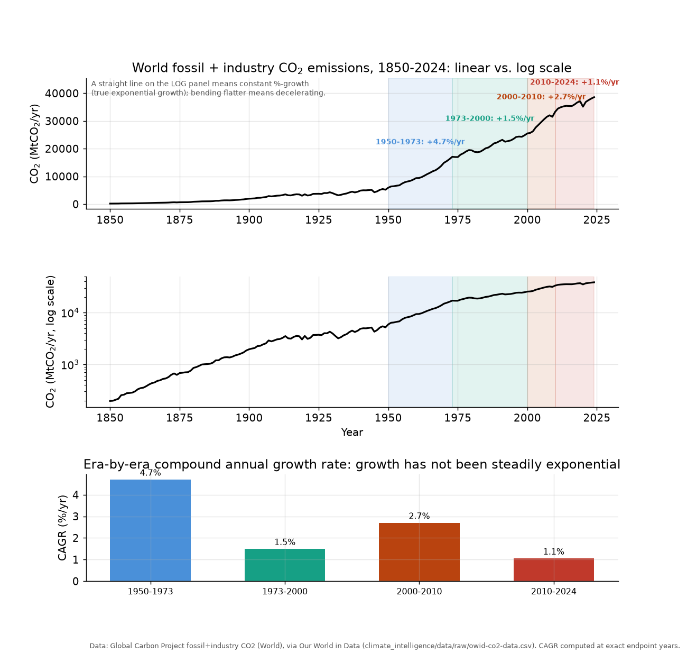
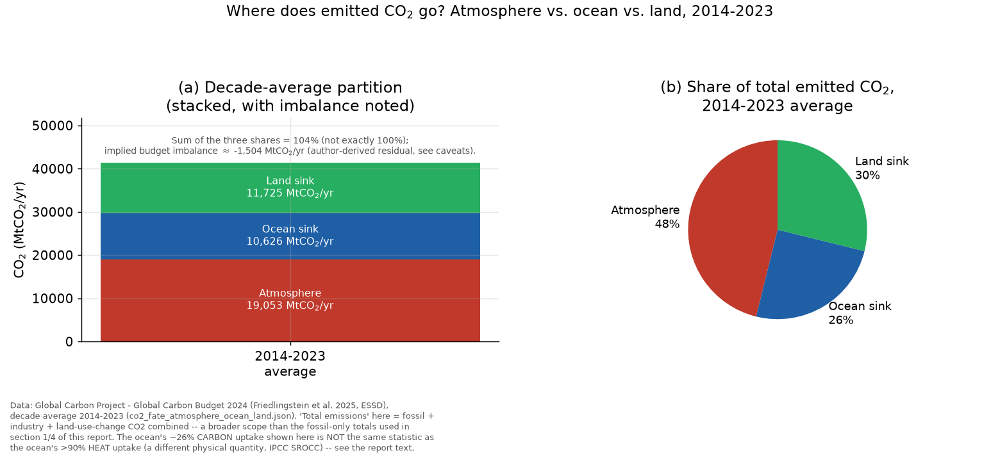
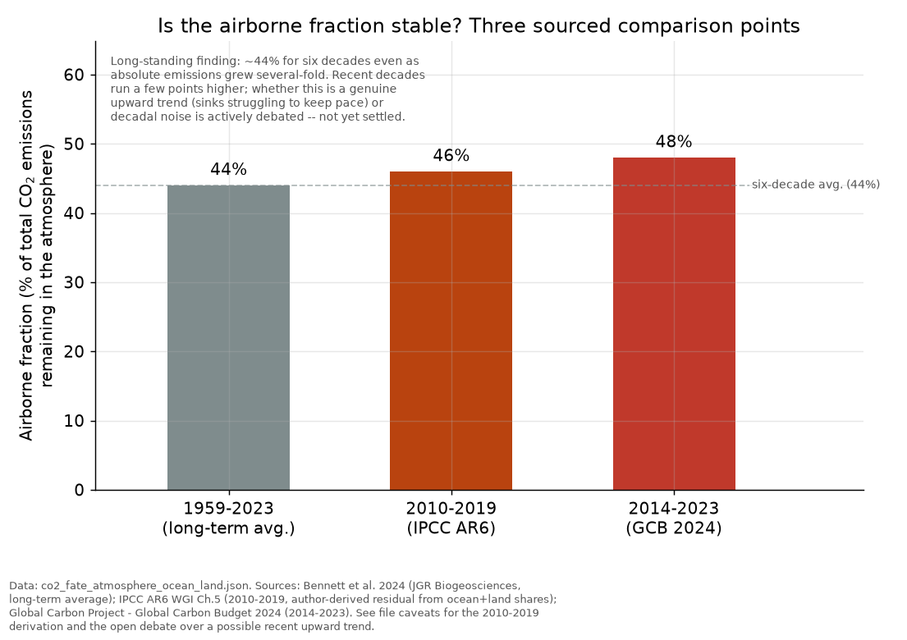
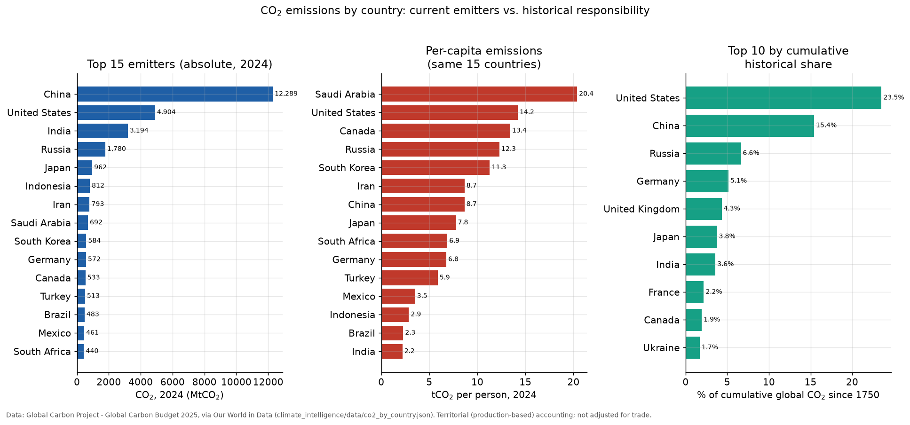
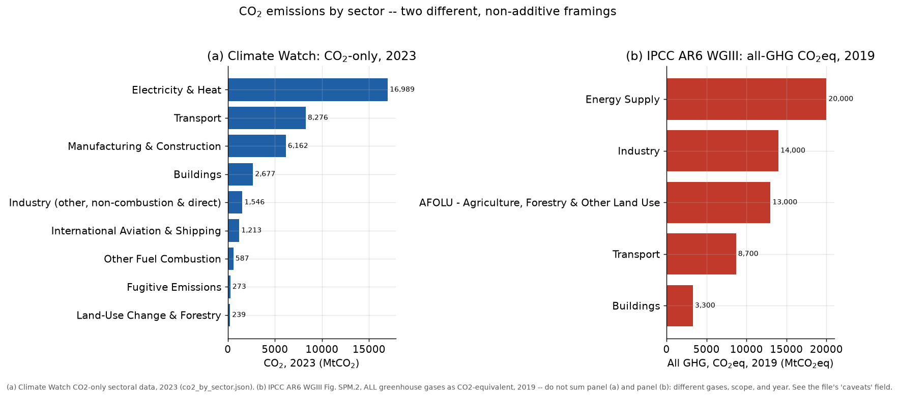
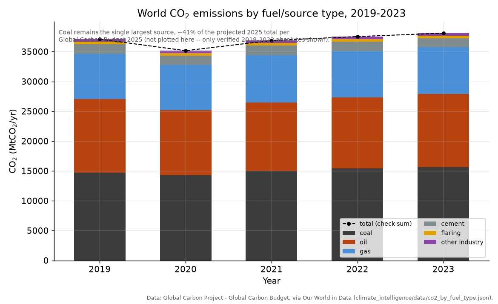
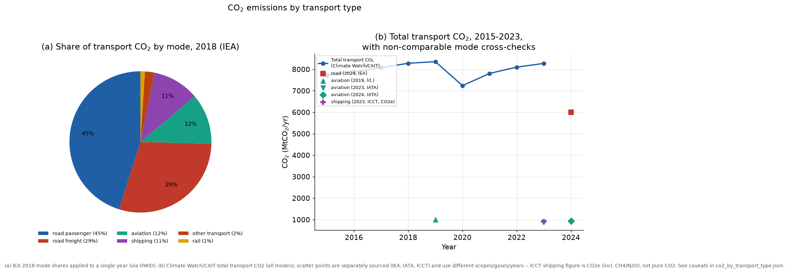
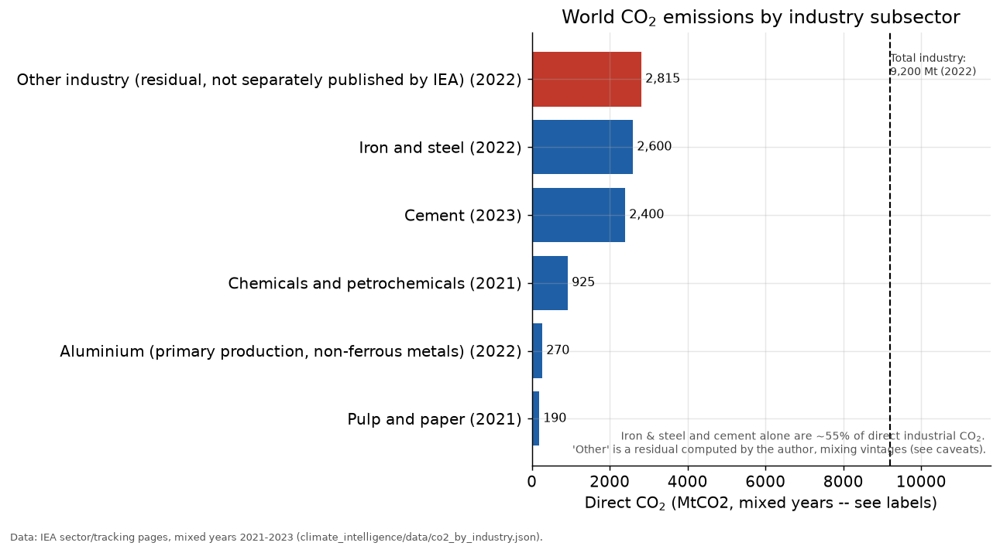
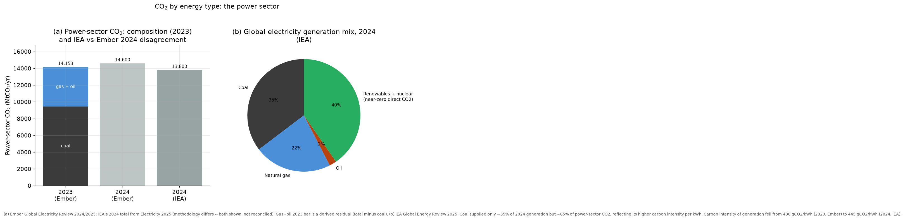

# The World's CO₂ Emissions: A 2026 Status Report

*Climate Intelligence — J. Xavier Prochaska and Claude*

All figures in this report are generated by [`make_co2_figures.py`](make_co2_figures.py)
from seven machine-readable datasets in `climate_intelligence/data/CO2/*.json`
(each carrying its own `provenance` and `caveats` fields) plus the long-run
historical series cached in `climate_intelligence/data/raw/owid-co2-data.csv`.
Every number quoted below traces to one of those files or to
`context/claudes_context.md` (cited by section). Where sources disagree, we
say so rather than picking a winner — that is this blog's editorial standard.

---

## 1. Summary

The world emitted an estimated **38,598.6 MtCO₂** (≈38.6 GtCO₂) of fossil-fuel-
and-industry CO₂ in 2024 — a record high at the time
(`co2_by_country.json`, Global Carbon Budget 2025). The same Global Carbon
Budget 2025 report is also the source, via a different research pass, for a
widely circulated **~38.1 GtCO₂** figure described as a new record for 2025,
"up 1.1% from 2024" (`co2_by_fuel_type.json` caveats;
`context/claudes_context.md` §8). **We flag honestly that these two numbers,
taken from the same underlying report, do not appear internally consistent
as captured in our source datasets** — 38.1 Gt is *lower* than the 38.6 Gt
recorded for 2024, yet is described as a 1.1% increase over 2024. This could
reflect a scope difference (e.g. a slightly different accounting boundary
between the two figures) or a transcription/rounding issue in one of the two
research passes; we have not been able to resolve it from the cached data
alone and present both numbers rather than silently picking one. Either way,
recent years are unambiguously at or near record annual emissions.

Emissions have grown almost every year for over a century (Figure 23), but
the **rate** of growth has not been constant: it peaked at **+4.7%/yr** in
the 1950–1973 postwar boom, slowed to **+1.5%/yr** in 1973–2000, re-
accelerated to **+2.7%/yr** in 2000–2010 (China's industrialization), and has
since slowed again to **+1.1%/yr** in 2010–2024 — even as absolute emissions
hit successive records. See §10 for why "record emissions" and "decelerating
growth" are both true at once.

Cumulatively, the world has emitted roughly **1,849 GtCO₂** of fossil +
industry CO₂ since 1750 (`owid-co2-data.csv`, World `cumulative_co2`, 2024).
The IPCC's headline cumulative-CO₂ figure of **~2,400 GtCO₂ for 1850–2019**
(`context/claudes_context.md` §2) is *not* directly comparable — it includes
land-use-change CO₂, which the Global Carbon Project tracks separately, and
covers a different time window. Both figures point the same direction: most
of the carbon budget consistent with 1.5°C has already been spent, and the
remaining 1.5°C budget is now down to roughly **170 GtCO₂ — about four years
at current emission rates** (`context/claudes_context.md` §8).

*Figure 23. World fossil + industry CO₂, 1850–2024, linear (top) and log
(middle) scales, with four eras shaded and their compound annual growth
rates (CAGR) computed directly from the data and shown in a bar panel
(bottom). Data: Global Carbon Project via OWID
(`climate_intelligence/data/raw/owid-co2-data.csv`).*

---

## 2. The fate of emitted CO₂: atmosphere vs. ocean vs. land sinks

Every other section in this report asks *where CO₂ comes from* — which
country, sector, fuel, or industry emitted it. This section asks a
different, and arguably more consequential, question: once emitted, *where
does it go?* Not all of it stays in the air. Averaged over 2014–2023, of
every tonne of CO₂ the world emitted — fossil fuel + industry + land-use
change combined, the Global Carbon Project's "total emissions" scope for
this specific accounting, which is broader than the fossil-only totals used
in §1 and §5 below — roughly **48% remained in the atmosphere** (19,053
MtCO₂/yr), **26% was absorbed by the ocean** (10,626 MtCO₂/yr), and **30%
was absorbed by land ecosystems** (11,725 MtCO₂/yr): vegetation regrowth,
soils, and the residual terrestrial sink
(`co2_fate_atmosphere_ocean_land.json`, Global Carbon Project — Global
Carbon Budget 2024, Friedlingstein et al. 2025, Earth System Science Data).
Those three shares sum to 104%, not 100%, because each is independently
rounded from a component carrying its own uncertainty; the ~4-percentage-
point gap is consistent with the Global Carbon Budget's own
characterization of its "budget imbalance" term as near-zero on average but
not exactly zero — see the dataset's `caveats` field for the derivation of
the ~−1,504 MtCO₂/yr residual shown in Figure 30.

*Figure 30. (a) Stacked decade-average partition of total emitted CO₂
(fossil + industry + land-use change) into atmosphere, ocean sink, and land
sink, 2014–2023 average, with the small implied budget-imbalance residual
noted. (b) The same partition as a share-of-total pie — 48% / 26% / 30%.
Data: Global Carbon Project — Global Carbon Budget 2024 (Friedlingstein et
al. 2025, ESSD), via `co2_fate_atmosphere_ocean_land.json`.*

**Do not confuse this with ocean heat uptake.** The ocean's ~26% share of
absorbed *carbon* is a completely different statistic from its role in the
planet's heat budget: the ocean has absorbed **>90% of excess heat**
(`context/claudes_context.md` §3.7), a number that gets cited constantly in
climate reporting and is *not* the same physical quantity as the ~26%
carbon-uptake figure above. The ocean is simultaneously a modest carbon sink
and an overwhelmingly dominant heat sink — CO₂ solubility/mixing and heat
diffusion are governed by different physics — and conflating the two would
be a genuine, if easy to make, mistake for a climate blog.

**Has this partition been stable over time?** The classic finding, dating
to Canadell et al. (2007) and reaffirmed as recently as Bennett et al. 2024
(*Journal of Geophysical Research: Biogeosciences*), is that the airborne
fraction has held remarkably steady at roughly **44%** for six decades
(1959–2023) even as absolute annual emissions grew several-fold — meaning
the ocean and land sinks have scaled up their *absolute* uptake roughly in
proportion to rising emissions, rather than staying fixed. Comparing three
sourced points over time (Figure 31) — 44% for the full 1959–2023 record,
46% for 2010–2019 (IPCC AR6 WGI Chapter 5, citing Friedlingstein et al.
2020), and 48% for 2014–2023 (Global Carbon Budget 2024) — shows recent
decades running a few points above the long-term average. Whether this
reflects a genuine weakening of the combined sinks' ability to keep pace
with rising emissions, or ordinary decadal variability, is an open question
in the literature: a 2026 preprint reanalyzing land-use emissions
(*Multi-source land-use emissions reveal rising airborne fraction*,
arXiv:2605.30242) argues the fraction has been gradually rising from ~41%
(1959) to ~48% (2024), while the longer-established consensus still treats
~44% as the representative long-run value. We present both framings rather
than picking a winner, consistent with this report's editorial standard of
flagging genuine open questions rather than resolving them by fiat.

*Figure 31. The atmosphere's share of total emitted CO₂ (the "airborne
fraction") compared across three sourced periods: the 1959–2023 long-term
average (44%, Bennett et al. 2024), the 2010–2019 decade (46%, IPCC AR6 WGI
Chapter 5), and the 2014–2023 decade (48%, Global Carbon Budget 2024). Data:
`co2_fate_atmosphere_ocean_land.json`; see its caveats for the 2010–2019
derivation and the open debate over whether the recent decades' higher
values reflect a genuine upward trend or decadal noise.*

---

## 3. Breakdown by country

In 2024, **China** (12,289 MtCO₂) and the **United States** (4,904 MtCO₂)
remained the two largest annual emitters, followed by **India** (3,194 MtCO₂),
**Russia** (1,781 MtCO₂), and **Japan** (962 MtCO₂) — together with the rest
of the top 15 shown in Figure 24a
(`climate_intelligence/data/co2_by_country.json`, Global Carbon Project -
Global Carbon Budget 2025).

But *who emits the most today* and *who is historically responsible* are
different questions with different answers. On a **per-capita** basis, Saudi
Arabia (20.4 tCO₂/person), the US (14.2), Canada (13.4), Russia (12.3), and
South Korea (11.3) top the same 15-country list — while China, the largest
absolute emitter, sits at a comparatively modest 8.7 t/person, and India, the
third-largest absolute emitter, sits at just 2.2 t/person (Figure 24b). On
**cumulative** emissions since 1750, the US alone accounts for **23.5%** of
all CO₂ ever emitted, versus China's **15.4%**, despite China's larger recent
annual total (Figure 24c). This is precisely the "who caused it vs. who
emits it now" tension flagged as a live editorial theme (theme 4, "Equity as
physics-adjacent") in `context/claudes_context.md` §5.

*Figure 24. (a) Top 15 emitters by absolute 2024 CO₂. (b) Per-capita CO₂ for
the same 15 countries. (c) Top 10 countries by cumulative share of global CO₂
since 1750. Data: Global Carbon Project - Global Carbon Budget 2025, via Our
World in Data (`co2_by_country.json`). Figures are territorial
(production-based) and not adjusted for trade — consumption-based accounting
would shift some emissions from exporters like China toward importing
countries.*

---

## 4. Breakdown by sector

Two independent framings exist, and they should not be summed together
(Figure 25). **Climate Watch's** CO₂-only sectoral data for 2023 shows
**Electricity & Heat** dominating at 16,989 MtCO₂ (45% of the Climate Watch
total), followed by **Transport** (8,276 Mt), **Manufacturing & Construction**
(6,162 Mt), **Buildings** (2,677 Mt), and smaller categories down to
**Land-Use Change & Forestry** (239 Mt). The Climate Watch sector sum for
2023 (37,963 Mt) is close to but not identical to the Global Carbon Project's
independent 2023 fossil+industry total (38,094 Mt) — a ~0.3% discrepancy the
dataset attributes to different underlying sources, sector boundaries, and
(for Climate Watch) inclusion of land-use-change CO₂
(`co2_by_sector.json` caveats).

Separately, the **IPCC AR6 WGIII** Figure SPM.2 breakdown (2019, **all
greenhouse gases as CO₂-equivalent** — not CO₂ alone) is the standard policy
reference: Energy Supply 34% (20,000 MtCO₂eq), Industry 24% (14,000),
AFOLU 22% (13,000), Transport 15% (8,700), Buildings 6% (3,300)
(`context/claudes_context.md` §3.4; `co2_by_sector.json`). These two panels
use different gases, different scopes, and different years — do not add them
together.

*Figure 25. (a) Climate Watch CO₂-only sector data, 2023. (b) IPCC AR6 WGIII,
all greenhouse gases as CO₂-equivalent, 2019. Data:
`co2_by_sector.json`; see its `caveats` field for the full scope discussion.*

---

## 5. Breakdown by fuel type

Coal remains the single largest CO₂ source: **15,636 MtCO₂** in 2023 (41.0%
of the 38,094 Mt total), ahead of oil (**12,278 Mt**, 32.2%), natural gas
(**7,803 Mt**, 20.5%), cement (**1,540 Mt**, 4.0%), flaring (**411 Mt**), and
other industrial processes (**425 Mt**) (`co2_by_fuel_type.json`, Global
Carbon Project via OWID). The mix has been remarkably stable across
2019–2023 (Figure 26); the Global Carbon Budget 2025's preliminary 2025
shares (coal ~41%, oil ~32%, gas ~21%) suggest this stability has continued,
though those 2025 figures are shares/projections rather than finalized
absolute values and so are not plotted directly (`co2_by_fuel_type.json`
caveats).

*Figure 26. World CO₂ by fuel/source type, 2019–2023 (stacked bars) with the
independently reported total overlaid as a check. Data:
`co2_by_fuel_type.json`.*

---

## 6. Breakdown by transport type

No single authoritative source publishes an annually updated, full mode-by-
mode breakdown of transport CO₂ — this is one of the more patchwork datasets
in this report (`co2_by_transport_type.json` caveats). The most detailed
available split is IEA's 2018 percentage shares: **road passenger 45%**,
**road freight 29%**, **aviation 12%**, **shipping 11%**, **rail 1%**, other
2% (Figure 27a) — meaning road transport alone accounts for roughly
three-quarters of transport CO₂. Total transport CO₂ (Climate Watch/CAIT,
all modes) dipped sharply in the 2020 pandemic (7,242 Mt, from 8,358 Mt in
2019) and had recovered to 8,276 Mt by 2023 (Figure 27b) — matching the
Climate Watch sector total in §4 exactly, since both come from the same
source.

More recent mode-specific figures exist but come from different
organizations, scopes, and gases, so they are shown as separate cross-check
points rather than spliced into one series: IEA reports road-transport CO₂
"just over 6,000 Mt" in 2024, growing only **0.2%/yr on average from
2019–2024** — real evidence of decoupling even as fleets grow. IATA reports
commercial aviation CO₂ at 882 Mt (2023) and 942 Mt (2024); an
academic-literature estimate (Bergero et al. 2023) puts *all* aviation at
~1,000 Mt in 2019. ICCT reports shipping at 911 MtCO₂**e** for 2023 (a
CO₂-equivalent figure including methane and N₂O, not pure CO₂, so not
directly additive with the other numbers).

*Figure 27. (a) Share of transport CO₂ by mode, 2018 (IEA). (b) Total
transport CO₂, 2015–2023 (Climate Watch/CAIT), with separately sourced
recent mode-specific points annotated for context, not comparability. Data:
`co2_by_transport_type.json`.*

---

## 7. Breakdown by industry

Within industry, **iron & steel** (2,600 MtCO₂, 2022) and **cement**
(2,400 MtCO₂e, 2023) are the two largest subsectors, together roughly **55%**
of direct industrial CO₂, followed by **chemicals & petrochemicals**
(925 Mt, 2021), **aluminium** (270 Mt direct, 2022 — rising to roughly
1 GtCO₂e once electricity-related indirect emissions are included, since
primary smelting is highly electricity-intensive), and **pulp & paper**
(190 Mt, 2021, an all-time high amid a production spike). IEA's published
total for all of industry is **9,200 MtCO₂** (2022); the named subsectors
above sum to only ~6,385 Mt, leaving a residual of **2,815 Mt** attributed by
the author to unallocated light manufacturing, machinery, mining, and other
industry not separately published by IEA (`co2_by_industry.json` caveats —
this residual mixes data vintages and should be treated cautiously).

*Figure 28. Direct CO₂ by industry subsector, each labelled with its data
year (2021–2023, mixed vintages — see caveats). The dashed line marks IEA's
9,200 Mt total-industry figure for 2022. Data: `co2_by_industry.json`.*

---

## 8. Breakdown by energy type (power generation)

The power (electricity & heat) sector is where fuel mix and CO₂ intensity
diverge most starkly: coal supplied only **~35%** of global electricity
generation in 2024 but produced roughly **~65%** of power-sector CO₂,
because it is far more carbon-intensive per kWh than gas. Ember's Global
Electricity Review puts total power-sector CO₂ at **14,153 MtCO₂** in 2023
and **14,600 MtCO₂** in 2024 (a new record, +1.6% year-on-year) — but IEA's
own Electricity 2025 report gives a **lower** 2024 estimate of **~13,800
MtCO₂**, a ~6% discrepancy the two organizations attribute to different
plant boundaries and estimation methods (`co2_by_energy_type.json` caveats;
both figures are shown in Figure 29a rather than reconciled).

On the generation side, 2024 was the **first year on record** that
renewables + nuclear together supplied more than **40%** of global
electricity generation (renewables alone ~32%: hydro 14%, wind 8%, solar PV
7%, bioenergy 3%; nuclear ~9%), with coal at 35%, gas 22%, and oil ~2%
(Figure 29b, IEA Global Energy Review 2025). The average carbon intensity of
global electricity fell from **480 gCO₂/kWh in 2023** (the cleanest on
record since at least 2000, per Ember) to **445 gCO₂/kWh in 2024** (IEA),
which IEA forecasts continuing to decline toward ~415 gCO₂/kWh by 2026.

*Figure 29. (a) Power-sector CO₂ composition (coal vs. gas+oil, 2023) and the
IEA-vs-Ember disagreement over the 2024 total. (b) 2024 global electricity
generation mix. Data: `co2_by_energy_type.json`.*

---

## 9. Growth and trend analysis: is it exponential?

**Short answer: no, not steadily — and that is the more interesting, more
honest story than a flat "yes."**

A textbook exponential process grows at a constant percentage rate forever,
which on a log-scale plot appears as a straight line. Figure 23's log panel
shows something more nuanced: the curve is *roughly* linear-on-log from
1850 to about 1950 (an early industrial-era exponential regime, consistent
with the Murphy textbook's framing of the fossil-fueled era as a runaway
growth phase — `context/claudes_context.md` §3.1), but its slope has
visibly changed shape since, bending through distinct regimes rather than
holding one constant rate.

The four era-by-era compound annual growth rates, computed directly from
the OWID/Global Carbon Project World series
(`climate_intelligence/data/raw/owid-co2-data.csv`), make this concrete:

| Era | CAGR | Context |
|---|---|---|
| 1950–1973 | **+4.71%/yr** | Postwar reconstruction, cheap oil, mass motorization |
| 1973–2000 | **+1.50%/yr** | Oil shocks, efficiency gains, slower OECD growth |
| 2000–2010 | **+2.71%/yr** | China's WTO-era industrial buildout |
| 2010–2024 | **+1.06%/yr** | Renewables scale-up, OECD plateau/decline, EV/solar growth |

Growth **decelerated** after the postwar boom, **re-accelerated** in the
2000s as China industrialized, and has **decelerated again** over the last
decade-plus — even as *absolute* emissions have kept climbing to successive
records (§1 discusses the 38.1 vs. 38.6 Gt discrepancy in the most recent
two years' figures). Both things are true at once: the source material
describes the most recent year as a "record high" (`co2_by_fuel_type.json`
caveats; `context/claudes_context.md` §8), while the reported single-year
growth rate behind that record (+1.1%, per the same caveats field) is, at
face value, far below the 1950s–1970s or 2000s pace, and in the same range
as our own computed 2010–2024 CAGR of +1.06%/yr. This matches the "genuinely
more nuanced 2020s story" flagged in
`context/claudes_context.md` §8: renewables and nuclear crossing 40% of
global power generation, solar becoming the single largest source of
energy-demand growth in 2025, and EV sales topping 1-in-4 new cars are all
real, measurable drags on the growth rate — they are just not yet enough to
turn absolute emissions downward. A pollutant that accumulates in the
atmosphere (unlike, say, a river pollutant that flushes out) requires
**net-zero**, not merely *slower growth*, before warming stabilizes — the
near-linear cumulative-CO₂-to-warming relationship (TCRE, ~0.45°C per 1,000
GtCO₂; `context/claudes_context.md` §2) means every additional year of
positive emissions, however slow-growing, adds to the committed warming.

---

## 10. Drivers

- **Fossil fuel dominance, coal above all.** Coal alone is ~41% of global
  CO₂ (§5) and ~65% of power-sector CO₂ despite supplying only ~35% of
  generation (§8) — its outsized carbon intensity per kWh is the single
  largest structural driver of the power sector's emissions.
- **Historical energy-economy coupling.** Murphy's textbook analysis
  (`context/claudes_context.md` §3.1) documents a historical coupling of
  roughly 5 MJ per dollar of GDP; economic growth has, for most of the
  industrial era, moved in lockstep with energy (and hence CO₂) growth,
  which is the deep driver behind the 1950–1973 and 2000–2010 acceleration
  eras identified in §9.
- **Industrialization waves.** The postwar boom (1950–1973) and China's
  2000s buildout are the two clearest step-changes in the historical record
  (§9); both are periods of rapid industrial-sector and power-sector
  capacity expansion, visible in the sector (§4) and industry (§7)
  breakdowns.
- **Transport's continued, if slowing, growth.** Road transport (§6) is
  ~75% of transport CO₂ and grew only 0.2%/yr from 2019–2024 (IEA) — slow
  by historical standards, but still net-positive, unlike the "record but
  decelerating" story that applies economy-wide.
- **Country-level concentration.** Three countries — China, the US, and
  India — account for over half of current annual emissions (§3), meaning
  their individual energy-mix and growth decisions dominate the global
  trend more than any other single factor.

---

## 11. Implications

The remaining carbon budget frames everything above in stakes. At current
emission rates (~38–39 GtCO₂/yr), the ~170 GtCO₂ remaining for a 50% chance
of holding to 1.5°C (`context/claudes_context.md` §8) is consumed in
roughly **four years** — a number that keeps shrinking even as annual growth
*rates* decelerate, because the budget is depleted by the *level* of
emissions, not their growth rate. The historical-cumulative story in §3 (US
23.5%, China 15.4% of all CO₂ since 1750) is not just a moral bookkeeping
exercise — TCRE's near-linear cumulative-CO₂-to-warming relationship
(§9; `context/claudes_context.md` §2) means that historical responsibility
and physical warming contribution are, to first order, the same
quantity. The mismatch between "record annual emissions" and "decelerating
growth rate" documented in §9 implies that current policy and market trends
are bending the curve, but not yet fast enough to peak, let alone reach
net-zero, on a 1.5°C-consistent timeline (which required global GHG to peak
before 2025 and fall 43% by 2030 per IPCC AR6 WGIII —
`context/claudes_context.md` §2, §3.4).

---

## 12. Risks

- **Existing infrastructure lock-in.** Committed CO₂ from existing and
  planned fossil infrastructure (~850 GtCO₂, IPCC AR6 WGIII) alone exceeds
  the remaining 1.5°C budget even before counting any new construction
  (`context/claudes_context.md` §3.4).
- **Measurement disagreement undermines confident tracking.** Independent
  agencies disagree by non-trivial margins on core numbers: IEA vs. Ember
  differ by ~800 Mt (~6%) on 2024 power-sector CO₂ (§8); Climate Watch vs.
  Global Carbon Project differ by ~130 Mt (~0.3%) on the 2023 sector total
  (§4); the transport-by-mode dataset has no clean single annual source at
  all (§6). Policy and public accountability built on any single number
  risks being built on shakier ground than it appears.
- **Deceleration is not the same as peaking.** The 2010–2024 slowdown to
  +1.06%/yr (§9) could itself decelerate further, stall, or reverse — recent
  history shows growth rates can re-accelerate (as they did in 2000–2010)
  if a large economy re-industrializes on fossil fuels.
- **Hard-to-abate sectors persist.** Aviation and shipping (§6), cement and
  steel (§7) lack mature, at-scale zero-carbon substitutes for their process
  emissions, and are among the categories the IPCC flags as requiring carbon
  dioxide removal (CDR) to reach net-zero (`context/claudes_context.md` §3.4).

---

## 13. Opportunities

- **The power sector's mix is genuinely turning over.** Renewables +
  nuclear crossing 40% of global generation for the first time (§8), and
  solar becoming the single largest source of energy-demand growth in 2025
  (`context/claudes_context.md` §8), are concrete, measured turns — not
  aspirational targets.
- **Cost curves keep falling.** 2010–2019 unit costs fell ~85% (solar), ~55%
  (wind), ~85% (batteries), with solar deployment >10× and EVs >100×
  (`context/claudes_context.md` §2, §3.4) — the economic case for
  displacing coal (§5, §8) keeps strengthening.
- **Cheap mitigation remains available.** IPCC AR6 WGIII estimates options
  costing ≤US$100/tCO₂ could halve 2019 emissions by 2030
  (`context/claudes_context.md` §3.4).
- **Demand-side measures are underused.** Up to 40–70% of end-use emissions
  could be cut by 2050 through demand-side changes alone
  (`context/claudes_context.md` §3.4) — a lever largely outside the
  supply-side fuel/sector/energy-type breakdowns in §4–§8.
- **Road transport is already decoupling.** 0.2%/yr growth in road CO₂
  from 2019–2024 despite rising vehicle fleets and travel (§6, §10) shows
  efficiency and electrification gains are outpacing activity growth in at
  least one major sector.

---

## 14. Solutions

- **Prioritize coal phase-down.** Given coal's outsized 41% fuel-type share
  and ~65% power-sector CO₂ share (§5, §8), no other single lever moves the
  aggregate number as much per unit of effort.
- **Electrify transport and industry while cleaning the grid
  simultaneously** — electrification without decarbonizing the underlying
  generation mix (§8) merely relocates emissions rather than cutting them.
- **Deploy CDR for genuinely hard-to-abate residuals** (cement calcination,
  steel process emissions, aviation) rather than treating it as a
  substitute for near-term fossil-fuel reductions elsewhere
  (`context/claudes_context.md` §3.4).
- **Scale mitigation finance 3–6×**, as IPCC AR6 WGIII estimates is required
  (`context/claudes_context.md` §3.4), and address the consumption-side
  equity gap — the top 10% of households account for 34–45% of household
  emissions, the bottom 50% for only 13–15% (`context/claudes_context.md`
  §3.5) — when designing who bears transition costs.
- **Harmonize or transparently reconcile measurement methodologies**
  (IEA/Ember, Climate Watch/GCP) so that policy tracking is not built on
  numbers that quietly disagree by several percent (§8, §12).

---

## 15. Next steps

1. **Re-run this analysis once 2025 final data are published** (the Global
   Carbon Budget's ~38.1 Gt figure is currently a preliminary projection —
   `co2_by_fuel_type.json` caveats) to confirm whether the 2010–2024
   deceleration trend (§9) held through 2025 or shifted.
2. **Seek a genuine, single-source annual transport-by-mode series** — the
   current dataset stitches together 2018 IEA shares with later absolute
   totals from different sources (§6); a cleaner primary source (e.g. a
   future ICCT or IEA release with consistent annual mode splits) would
   remove one of this report's largest caveats.
3. **Track the IEA-vs-Ember power-sector gap over time** (§8, §12) to see
   whether it narrows, which would increase confidence in the "clean
   generation crossing 40%" story, or widens, which would warrant a closer
   methodological audit before leaning on either figure alone.
4. **Update the industry breakdown (§7) to a single consistent vintage**
   once IEA publishes subsector figures for a common year, resolving the
   current 2021–2023 mixed-vintage residual.
5. **Consider a companion post on consumption-based (trade-adjusted)
   emissions**, since all figures here are territorial/production-based
   (§3 caveats) and the production-vs-consumption distinction materially
   changes the "who is responsible" answer, especially for China vs. the US
   and EU.

---

*Figures: `fig23_global_co2_growth.png` through `fig31_airborne_fraction_history.png`,
generated by [`make_co2_figures.py`](make_co2_figures.py). Data provenance
and caveats for every number above are recorded in
`climate_intelligence/data/CO2/*.json` and
`climate_intelligence/data/raw/owid-co2-data.csv`. See `claude_prompts/co2.md`
for the research/Q&A history behind this dataset.*
