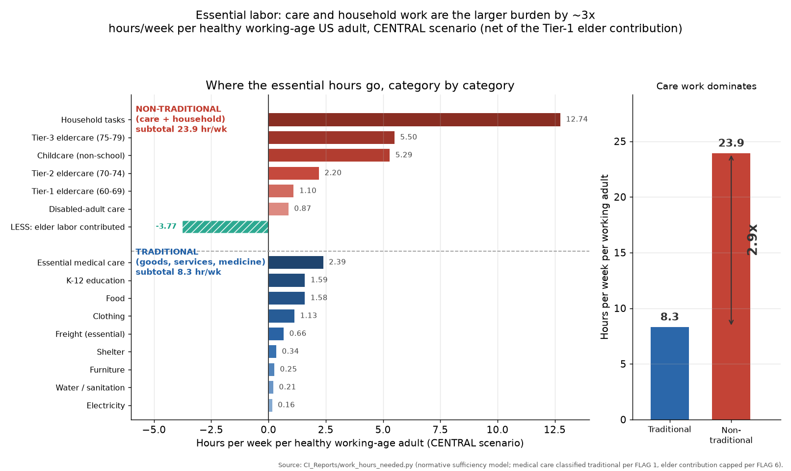
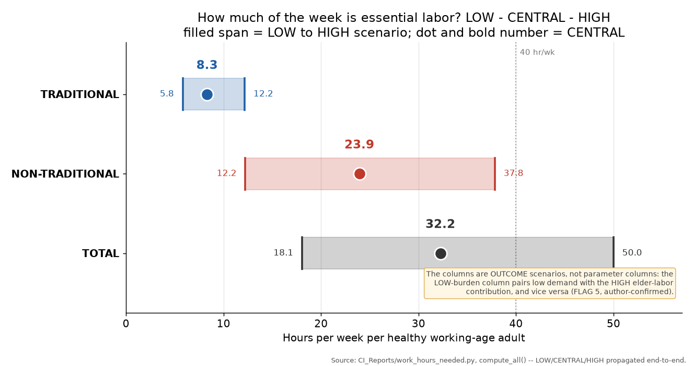
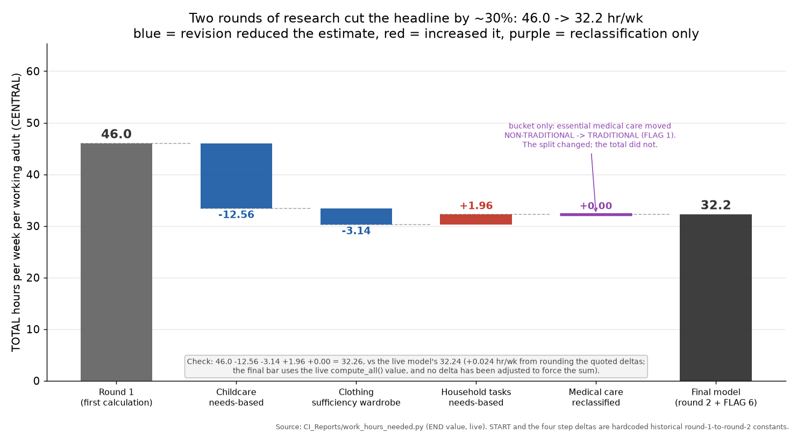

# How Much Work Does a Decent Life Actually Require?

### A normative labor-hours accounting for the United States

*J. Xavier Prochaska and Claude — Climate Intelligence, 2026-08-17*

*(A companion calculation to the main climate report. The model, every settled
assumption, all data sources, and the full flag history live in
[`CI_Reports/work_hours_needed.py`](work_hours_needed.py); this piece reports and
interprets its output rather than re-deriving it.)*

---

## 1. Why a labor-hours question belongs on a climate blog

The throughline of this blog's energy sections — and of Tom Murphy's
*Energy and Human Ambitions on a Finite Planet*
([DOI 10.21221/S2978-0-578-86717-5](https://doi.org/10.21221/S2978-0-578-86717-5)),
which supplies much of our framing — is that physics puts a ceiling on the human
enterprise, and that the interesting question on the far side of that ceiling is
not "how do we keep growing?" but "what does *enough* look like?" Murphy's most
provocative arithmetic is not the waste-heat limit or the EROI table; it is the
observation that, in a modern economy, well under a tenth of a percent of
spending buys all the essential physical goods a person consumes. Almost
everything we do with our energy, our materials, and our hours is, in his
accounting, discretionary.

That claim is usually made in dollars or joules. This piece makes it in **hours
of human labor** — arguably the most honest currency available, because it is the
one input that cannot be substituted or inflated away. Money prices are a poor
guide to sufficiency: they encode scarcity, branding, and rent as readily as they
encode effort. Labor-hours are what a society actually spends.

So the question we set ourselves was deliberately not the descriptive one. It is
not "how much do Americans work?" — the Bureau of Labor Statistics answers that
every month. It is:

> **How many hours of human labor per week, per healthy working-age adult, would
> it take to provide every person in the United States with a modest but
> genuinely decent standard of living — shelter, food, clothing, furniture,
> water, electricity, essential freight, K-12 schooling, essential medicine, and
> all of the care and household work that a life requires — counting paid and
> unpaid labor identically?**

That is a normative accounting question with a numerical answer, and the answer
turns out to be interesting. It is also, we will argue in §4, a question whose
answer says something about the essential/discretionary split at the heart of
the limits argument — though considerably less about policy than a reader might
be tempted to conclude.

## 2. The model in brief

Three design choices do most of the work. All three were settled in advance,
through three rounds of question-and-answer between us, before any number was
computed — which matters, because a normative model is only as honest as its
prior commitments.

**A stipulated life cycle, not the real age pyramid.** We build an idealized
steady state on an 80-year lifespan: twenty years as a child (0-19), five as a
college student (20-24), thirty-five working (25-59), then twenty in
post-employment life, subdivided into an *active* decade (60-69), a *frailty
transition* (70-74), and five years of full congregate care (75-79), with death
near 80. Under a stationary steady state each single year of age holds an equal
slice of the population, so the band shares fall out arithmetically. We apply
those shares to the *real* 2026 US head-count of about 343 million.

The age-60 exit from paid work is a stipulation, not a prediction. So is the
assumption of two children per household — replacement fertility, against
a real US total fertility rate of 1.599 (CDC, 2024). Both are flagged in §6.

**A sufficiency standard, not scaled-down current consumption.** "Minimal" admits
a factor-of-two range, so we pinned it down: roughly **250 square feet of
dwelling per person**; a **~2,300 kcal/day diet** with meat as a modest rather
than central component, cooked at home, with **no restaurant labor at all**; a
**small but durable wardrobe**, made concrete as the Hot or Cool Institute's
2022 "1.5-degree wardrobe" specification — 103 items at a stock-weighted average
service life of about 4.1 years; **basic-tier medicine**, meaning essential care
net of administrative waste and elective or low-value procedures; and
professional-standard child supervision during non-school waking hours. The
target is *modest but decent*, roughly mid-twentieth-century American material
provision delivered with 2026 technology — not austerity, and not a household
budget cut by some arbitrary percentage.

**Classify labor by activity, not by who pays.** This is the principle that makes
the model unusual, and it deserves the emphasis. **Traditional** work is the
production of essential goods and non-care services: shelter, food, clothing,
furniture, water and sanitation, electricity, essential freight, K-12 education,
and essential medical care. **Non-traditional** work is all care work —
childcare, eldercare, care of disabled adults — plus household tasks: cooking,
cleaning, laundry, shopping.

The boundary runs through the *activity*, so a nursing-home aide's hours and a
daughter's hours caring for her mother are the same category, counted once each.
K-12 teaching and medical care are the two deliberate carve-outs into
traditional: both are credentialed, institutionally organized professions
delivered by a dedicated workforce, rather than the diffuse unpaid care the
non-traditional bucket exists to surface.

The consequence is that **unpaid domestic and care labor counts identically to
paid production**. Every hour a parent spends supervising a toddler, every hour
spent cooking a meal that a restaurant did not cook, enters the ledger at full
weight. GDP does not do this; most economic accounting of "how much work society
needs" does not do this. It is the single largest reason our answer looks the way
it does.

Each of the model's roughly twenty input rates carries a LOW / CENTRAL / HIGH
value, propagated end to end, so the output is a range rather than a point.

## 3. The headline result

**Hours per week of essential labor, per healthy working-age (25-59) adult:**

| | LOW | CENTRAL | HIGH |
|---|---|---|---|
| Traditional | 5.8 | **8.3** | 12.2 |
| Non-traditional | 12.2 | **23.9** | 37.8 |
| **Total** | **18.1** | **32.2** | **50.0** |

The central estimate reads: **8.3 hours of traditional work plus 23.9 hours of
care and household work equals 32.2 hours per week per working adult** — 6.4
hours a day on a five-day week, or 4.6 hours a day if spread across all seven.
Nationally that is about 1.13 billion traditional and 3.27 billion
non-traditional hours per week. The LOW-to-HIGH span — nearly a factor of three —
is the honest bound on an estimate built from roughly twenty stipulated input
rates (Figure 21).

**How the population divides.** Of the ~343 million total: children 0-19 are
25.0% (85.8M) — care recipients whose schooling is counted on the traditional
side; college students 20-24 are 6.25% (21.4M) and are simply absent from both
sides of the ledger; adults 25-59 are 43.75% (150.1M), of whom 9.05% (13.6M) are
removed from the labor pool by a work-limiting health condition and instead
*generate* care demand at about a quarter of institutional intensity; Tier-1
active elders 60-69 are 12.5% (42.9M); Tier-2 frail elders 70-74 are 6.25%
(21.4M); Tier-3 institutional-care elders 75-79 are 6.25% (21.4M). **The
denominator — healthy working adults — is 136.5 million people, 39.8% of the
total population.** Every hour figure in this report is that population's
per-person load.

Note the two-sided treatment of the disability figure: we use the broader BLS
"work-limiting health condition" measure (12.4% prevalence, of whom 27% still
work), and the resulting non-working group is subtracted from labor supply *and*
added to care demand. Earlier drafts of the specification housed and fed this
group but gave them zero care hours, which was plainly wrong.

**Traditional work, by category** (hr/week per working adult, CENTRAL):

| Category | Hours |
|---|---|
| Essential medical care | 2.39 |
| K-12 education (all staff) | 1.59 |
| Food (farm + process + distribute) | 1.58 |
| Clothing (sufficiency wardrobe, embodied) | 1.13 |
| Essential freight | 0.66 |
| Shelter (build + materials + maintenance) | 0.34 |
| Furniture (import-adjusted) | 0.25 |
| Water / sanitation | 0.21 |
| Electricity | 0.16 |
| **Total** | **8.31** |

**Non-traditional work, by category** (hr/week per working adult, CENTRAL):

| Category | Hours |
|---|---|
| Household tasks (cooking, cleaning, laundry, shopping) | 12.74 |
| Tier-3 institutional elder care (75-79) | 5.50 |
| Childcare, non-school hours | 5.29 |
| Tier-2 elder support (70-74) | 2.20 |
| Tier-1 elder light support (60-69) | 1.10 |
| Disabled-adult care (25-59) | 0.87 |
| *Less:* Tier-1 elder labor contributed | **−3.77** |
| **Total** | **23.93** |



**Figure 20.** Traditional and non-traditional essential labor by category,
hours per week per working adult, CENTRAL scenario. Source:
`CI_Reports/work_hours_needed.py`.



**Figure 21.** The LOW / CENTRAL / HIGH range on the headline total, decomposed
into its traditional and non-traditional components. Source:
`CI_Reports/work_hours_needed.py`.

Four things stand out.

**First, non-traditional dwarfs traditional — by roughly three to one.** The
entire apparatus of essential material production — farms, food processing,
freight, construction, textiles, the electrical grid, the water system,
furniture — plus every school and every hospital, comes to 8.3 hours a week per
working adult. Cooking, cleaning, and caring for children, elders, and disabled
adults comes to 23.9. This is the model's central finding, and it is a direct
consequence of the activity-based classification: industrial production is
extraordinarily labor-efficient, and care is not, because care *is* the labor.
There is no productivity trick that lets one adult supervise eight infants
safely, and none that makes a meal cook itself.

**Second, on the traditional side, the heavyweights are services, not goods.**
Medical care (2.39) and K-12 education (1.59) together are nearly half the
traditional total, and food (1.58) is the largest goods category. Shelter is 0.34
hours a week — startling until you remember that a dwelling amortizes
construction labor over sixty to a hundred and thirty years of service life.
Electricity, the input that powers nearly everything else, requires about ten
minutes a week per working adult. Industrial systems are astonishingly good at
turning a few human hours into a great deal of physical provision; they are much
less good at doing that for anything that must be done *to a person*.

**Third, on the non-traditional side, household tasks alone are larger than the
entire traditional column.** 12.74 hours a week, and the largest single line in
the model. This is not an artifact of counting current behavior — it is what the
stipulated sufficiency standard requires, and (as §5 explains) it came out
*higher* than what Americans actually do. A restaurant-free, scratch-cooked diet
is genuinely expensive in hours. Childcare, at 5.29 hours, is smaller than most
readers will expect, and smaller than our own first estimate; that story is
also §5.

**Fourth, the elder tiers behave asymmetrically, and the active decade is a net
contributor.** Care intensity ramps steeply: light support at 60-69 (1.10),
roughly doubling in the frailty transition (2.20), then jumping to
nursing-home-intensity congregate care in the final five years (5.50, from CMS
Payroll-Based Journal hours-per-resident-day data). Meanwhile the 60-69 cohort
supplies non-traditional labor back into the system — grandchild care, household
help, care for their own peers — at a credited **−3.77 hours per week per
working adult**, which is about 13.6% of gross non-traditional demand at CENTRAL.
Treating recent retirees as pure dependents, as dependency-ratio arithmetic
usually does, is simply wrong: for a decade they are among the system's larger
net donors of care.

## 4. What the number means, and what it does not

Here is the comparison that makes this exercise worth publishing.

Average weekly hours for all employees on private nonfarm payrolls in the United
States run about **34.2 hours** ([BLS Current Employment
Statistics](https://www.bls.gov/ces/), blending full- and part-time workers
across every industry). That is **paid work alone**. It is measured *before* any
of the substantial additional unpaid care and household labor that most working
adults also perform — labor plainly visible in the [American Time Use
Survey](https://www.bls.gov/tus/), and the entire subject of this model's
non-traditional column.

Our model's total sufficiency requirement is **32.2 hours per week**, and that
figure covers *everything*: all essential goods and services production **and**
all care and household work, combined, for the whole population.

Stated plainly: **on this accounting, the labor burden of providing every
American a modest but genuinely decent standard of living is comparable to — or
somewhat less than — the paid-work hours alone that many Americans already
work.** If the model is roughly right, that gap admits two readings, and they
are not mutually exclusive:

1. **A great deal of current paid labor produces non-essential output.** Not bad
   output, not useless output — discretionary output, in Murphy's sense of the
   word. This is the labor-hours analogue of his dollar-based observation, and
   it lands in the same place from an entirely different direction.

2. **Unpaid care work is dramatically under-recognized as real labor.** When
   people debate "how much work society needs," they are almost always debating
   the 8.3-hour column and quietly assuming the 23.9-hour column takes care of
   itself. It does not. It is three-quarters of the total, and someone is doing
   it right now, uncounted.

Both readings point the same direction, and we think the second is the more
underappreciated of the two.

It is worth a brief nod to Keynes, who predicted in 1930 ("Economic
Possibilities for our Grandchildren") that his grandchildren would work fifteen
hours a week. Our central estimate is roughly double that — which is itself an
interesting data point. Sufficiency is more labor-intensive than Keynes assumed,
and specifically it is more labor-intensive *in the direction he did not count*.
He was thinking about factories and productivity growth, and on that he was not
far off: our traditional column is 8.3 hours, within shouting distance of his
fifteen. What he did not put on the ledger was cooking, cleaning, childcare, and
eldercare — the work that in 1930 was performed almost entirely by women and
almost entirely unremarked. That omission is most of the gap. We would rather
leave the parallel there than oversell it.

**Now the boundaries, which are load-bearing.** This is an accounting exercise,
not a policy proposal, and it does not license the conclusions it might seem to
invite:

- **It says nothing about distribution.** The model divides total required hours
  by total available workers. A real economy is unequal, and there is no
  mechanism in this arithmetic — none — by which the hours would actually be
  spread evenly. The 32.2 figure is an average over an idealized denominator, not
  a schedule anyone would experience.
- **It says nothing about coordination or feasibility.** Knowing that a task
  requires *N* hours in aggregate tells you nothing about whether a
  decentralized, uncoordinated economy of 340 million people could organize
  itself to supply exactly those hours and no others. That is the hard part, and
  we have not touched it.
- **It says nothing about transition.** No path, no politics, no timeline.
- **It says nothing normative about discretionary production.** The model does
  not claim that non-essential output is bad, wasteful, or ought to be reduced.
  It claims only that it is *not required for sufficiency* — which is a
  definitional statement about categories, not a judgment about value. Music,
  sport, travel, and scientific research are all discretionary by this
  accounting.

The honest summary is that we have measured the size of one box. What belongs
outside it, and who carries what share of what is inside, are separate questions
this model cannot answer.

## 5. How the estimate got here: a revision story

The first pass at this calculation produced a central estimate of **46.0 hours
per week** (9.1 traditional + 36.9 non-traditional). The current figure is
**32.2** — a 30% reduction. The movement is worth its own section, because the
three changes that produced it teach three genuinely different methodological
lessons, and together they are a decent case study in how a normative estimate
should be built (Figure 22).



**Figure 22.** Waterfall reconciling the round-1 central estimate (46.0 hr/week)
to the round-2 result (32.2 hr/week). Source:
`CI_Reports/work_hours_needed.py`.

Round 1 built shelter, food, eldercare, disability, medical care, education,
utilities, goods, and freight from four parallel research passes with primary
sources. But two categories — childcare and general household tasks — were still
raw American Time Use Survey *behavioral* benchmarks: what people currently do,
rather than the independent needs-based derivations specified in the very first
round of Q&A. Those two placeholders turned out to be **70% of all
non-traditional demand and 58% of the entire headline total**. The 46.0-hour
estimate was, in other words, resting mostly on its weakest-sourced part — which
is exactly the sort of thing worth saying out loud rather than discovering later.

Round 2 replaced both, rebuilt clothing from scratch, and reclassified medical
care. Three lessons came out of it.

**Lesson 1: a behavioral benchmark can badly overstate a needs estimate when the
behavior isn't the activity.** Childcare fell by about two-thirds — from 17.85 to
5.29 hours per week population-averaged, by far the largest single move. The
round-1 placeholder used ATUS **secondary childcare**: time spent with a child
present while doing something else — watching television, doing housework,
running errands. For a needs-based estimate that is double-counting, since those
other hours are already in the ledger under their own headings. The needs-based
rebuild works from *Caring for Our Children*, the AAP/APHA national child-care
health-and-safety standards, taking licensed child:staff ratios by age (3:1 for
infants, 4:1 toddlers, 7:1 to 8:1 preschool, 10:1 to 12:1 school-age), applying
them to pediatric sleep-consensus waking hours by age, subtracting in-school
hours already carried in the K-12 line, and summing over ages 0-17. That gives
about 9.35 required adult-supervision hours per week per child, which the model's
own children-per-working-adult ratio converts to the population average. The
result is independently corroborated **within 1%** by ATUS *primary* childcare —
undivided-attention time only — which is a genuinely satisfying convergence from
a completely different measurement approach.

**Lesson 2: needs-based estimates are not automatically lower than behavioral
ones.** Household tasks moved the *other* way, rising about 18%, from 10.78 to
12.74 hours per week. The rebuild used USDA Thrifty Food Plan
meal-preparation-time research for cooking, ISSA industry cleaning
time-and-motion standards (plus an independent hotel-housekeeping stopwatch
study) for cleaning, appliance loads-per-week data for laundry, and a reasoned
grocery-and-errands estimate — all career-weighted across the fraction of a
working life spent in a four-person versus a two-person household. A genuinely
scratch-cooked, restaurant-free sufficiency diet takes *more* labor than what
Americans currently do, because current practice leans on restaurants, processed
food, paid cleaning services, and — for many households — simply less thorough
upkeep. The lesson generalizes: needs-based and behavioral estimates diverge in
whichever direction current practice departs from the stipulated standard, and
here it departed toward *less* domestic labor than sufficiency actually requires.
Anyone who assumes a "needs" figure will come in below an "actual" figure has
assumed the answer.

**Lesson 3: "consume less" and "consume more durably" are different levers, and
conflating them hides which one matters.** Clothing fell by roughly 4x, from 1.70
to 0.45 hours per capita per week. The round-1 figure allocated the global
garment-industry workforce to US apparel consumption — a defensible method that
produced, on reverse-engineering, an implicit **~1.8-year garment replacement
cycle**. It was measuring current American fast-fashion *throughput*, not what a
durable wardrobe requires. Rebuilding bottom-up from an explicit sufficiency
specification — the Hot or Cool Institute's 103-item "1.5-degree wardrobe," a
stock-weighted average 4.1-year service life, and all-in labor-hours per garment
from fiber production through spinning, weaving, dyeing, cutting, sewing, and
finishing — gives the 4x reduction.

The interesting part is *why*. For wear-limited garments the labor requirement is
governed by stock divided by lifespan, and **wardrobe size largely cancels out of
that ratio**: a person with twice the wardrobe wears each item half as often and
replaces it half as fast. It is specifically **durability**, not smallness, that
buys the reduction. Our own sufficiency language — "a small durable wardrobe" —
had quietly bundled two levers together without noticing that only one of them
was doing any work. That is a mistake worth naming, because the same conflation
runs through a great deal of sufficiency and degrowth writing.

A fourth change moved no total at all: essential medical care was reclassified
from non-traditional to traditional, on the same logic as the existing K-12
carve-out. Only the bucket changed.

## 6. Limitations, honestly stated

**Stipulated fertility exceeds reality.** The model assumes two children per
household — approximately replacement — against a real US total fertility rate
of **1.599** (CDC, 2024). This is a deliberate normative idealization, not an
error, but it matters. A sub-replacement population has fewer children (less
childcare demand) and a heavier elder dependency ratio (more eldercare demand).
The two effects push the answer in opposite directions and we have not attempted
to net them. Relatedly, the idealized age structure gives a larger child share
and a notably larger old-age share than reality (25% under 20 and 25% over 60,
versus a real 21.5% under 18 and 18.0% over 65), which if anything **overstates**
dependency and therefore makes the headline conservative.

**The import-labor treatment is asymmetric.** Clothing and furniture are
import-adjusted, counting the embodied offshore labor — necessarily so, since
about 97% of US apparel is imported and a domestic-only figure would understate
the requirement by more than an order of magnitude. Most other traditional
categories are domestic-activity figures. Traditional hours are therefore
somewhat **understated** for any category with hidden import content, and the
8.3-hour traditional total should be read as a floor rather than a point
estimate.

**One mechanical correction, for the record.** After the round-2 rebuild, the
parameters governing how much non-traditional labor an active 60-69-year-old
contributes back were still calibrated against the older, larger demand total.
In the LOW-burden column this produced an internally inconsistent edge case — an
elder credited with more weekly care and household labor than a working adult's
entire net load of it. We fixed this with an exact closed-form cap ensuring a
Tier-1 elder's credited contribution can never exceed a working adult's own final
net burden in the same column; see FLAG 6 in the script for the derivation. The
cap binds only in the LOW column, changes no research number, and leaves CENTRAL
and HIGH untouched.

**The Tier-3 care intensity is a judgment-call blend.** LOW (3.48 hours per
resident-day) is the CMS regulatory-floor direct-care number; CENTRAL (5.0) adds
care-adjacent support staff — food, laundry, cleaning, activities — to the solid
Payroll-Based Journal direct-nursing figure, a defensible blend rather than a
single cited statistic; HIGH (7.0) approaches all-staff including overhead.

**The even split within households is normative.** Non-traditional labor is
divided evenly between a household's two adults. ATUS shows it is not. The model
describes a requirement, not an observed allocation.

**Scope is US-only and present-day.** No state or regional breakdown, no other
country, and no sensitivity analysis on future demographic shifts — a genuine
omission given that population aging is the variable most likely to move this
number over the coming decades. Also absent: any transport allowance for people
(only essential freight is counted), any allowance for the labor of governance,
public safety, or defense, and any allowance for the research and engineering
that keeps the productivity assumptions true. Each would push the traditional
column up.

**And the obvious one.** The LOW-to-HIGH span is 18.1 to 50.0 hours — nearly a
factor of three. The CENTRAL figure is our best estimate, not a measurement, and
readers who find any particular input rate implausible should reach for the
column that reflects their view rather than the middle one.

## 7. Methods and sources

The authoritative methods reference is the calculation script itself:
[`CI_Reports/work_hours_needed.py`](work_hours_needed.py). Its module docstring
documents the settled life cycle, the sufficiency standard, every input rate with
its provenance, the full FLAGS 1-6 history including the two flags that remain
open or accepted, and the complete source list. The script has no third-party
dependencies — it is transparent arithmetic by design — and runs with:

```
conda run -n ocean14 python CI_Reports/work_hours_needed.py
```

Every number in this report is its printed output.

**Major primary sources** across both research rounds:

- Population and vital statistics — [US Census Bureau Population
  Estimates](https://www.census.gov/programs-surveys/popest.html); [CDC National
  Center for Health Statistics](https://www.cdc.gov/nchs/) (life expectancy,
  total fertility rate).
- Labor and time use — [BLS Current Employment
  Statistics](https://www.bls.gov/ces/); [BLS Occupational Employment and Wage
  Statistics](https://www.bls.gov/oes/); [BLS American Time Use
  Survey](https://www.bls.gov/tus/), including its eldercare and disability
  supplements; BLS Employer Costs for Employee Compensation.
- Care standards — CMS Payroll-Based Journal nursing-home staffing data
  (hours per resident-day); [*Caring for Our
  Children*](https://nrckids.org/CFOC), 4th ed. (AAP, APHA, HRSA MCHB)
  child:staff ratios; American Academy of Sleep Medicine consensus
  sleep-duration recommendations; AARP grandparent-caregiving survey.
- Education — [NCES Digest of Education
  Statistics](https://nces.ed.gov/programs/digest/) staff-to-student ratios;
  NCES National Teacher and Principal Survey teacher hours.
- Food — [USDA Economic Research Service](https://www.ers.usda.gov/) food-dollar
  and food-labor series; USDA Thrifty Food Plan meal-preparation-time research
  (Rose, *J. Nutr. Educ. Behav.* 2007; Davis & You, USDA ERS / *Public Health
  Nutrition* 2010-2011).
- Clothing — [Hot or Cool Institute](https://hotorcool.org/) (2022), *Unfit,
  Unfair, Unfashionable: Resizing Fashion for a Fair Consumption Space*, the
  1.5-degree wardrobe specification.
- Household work standards — [ISSA](https://www.issa.com/) 540/612 cleaning
  time-and-motion standards; ENERGY STAR / DOE appliance loads-per-week data.
- Infrastructure and utilities — US Census Bureau Annual Survey of Public
  Employment & Payrolls (ASPEP), for the municipal water, sewer, solid-waste and
  public-electric workforce that BLS establishment data misses.
- Freight — [BTS/FHWA Freight Analysis Framework](https://www.bts.gov/faf)
  (FAF5.7) commodity split, for the essential-commodity fraction.
- Shelter — BLS Bulletins 1755 and 1892 construction labor-hours per square
  foot; Harvard Joint Center for Housing Studies paid-repair expenditure data.

**Framing sources** — Murphy, *Energy and Human Ambitions on a Finite Planet*
(2021), for the essential/discretionary distinction and the energy-limits
argument; Keynes, "Economic Possibilities for our Grandchildren" (1930), as the
cultural touchstone only.

---

*The full prompt and question-and-answer history that produced this model —
three preparatory rounds settling the normative assumptions, two calculation
rounds, and the scoping round for this document — is in
[`claude_prompts/work.md`](../claude_prompts/work.md). Readers who want to see
where the modeling choices came from, and which of them were genuinely arguable,
will find them there.*
