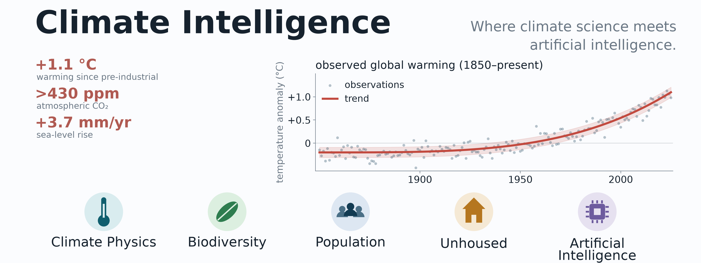

# Climate Intelligence

*A blog on the science of the climate — and a lot more.*

Climate Intelligence is a blog about the science of the climate, biodiversity,
and related topics. It is an explicit collaboration between a human author and
Claude (an AI by Anthropic), with the human providing direction, judgment, and
final review, and the AI contributing research, analysis, and drafting.

<!-- Banner above generated by docs/scripts/CI_graphic.py (run in the ocean14 env). -->

## What guides us

Everything here is grounded in primary sources — including the complete IPCC
AR6 assessment cycle (WGI, WGII, WGIII, the Synthesis Report, and the special
reports SR1.5, SROCC, and SRCCL), Tom Murphy's *Energy and Human Ambitions on
a Finite Planet*, and the work of James Hansen — rather than headlines or
hearsay.

A few of our guiding principles:

- Fact over opinion — while recognizing that every measurement bears
  uncertainty and bias.
- All viewpoints are welcome, but they are not all accepted equally.
- All life on Earth matters, not only human life.
- Respect statistics; mathematics trumps all.

## Topics

- Climate physics
- Biodiversity
- Global population
- Homelessness

More themes will be added as the blog grows.

## Developers / Authors

- **J. Xavier Prochaska** — UC Santa Cruz ([jxp@ucsc.edu](mailto:jxp@ucsc.edu))
<!-- Add additional developers/authors above this line, one bullet per person. -->

…in collaboration with Claude (Anthropic).

## License

This project is licensed under the BSD license. Source code and content live at
[github.com/Sea-Meets-the-Stars/ClimateIntelligence](https://github.com/Sea-Meets-the-Stars/ClimateIntelligence).
